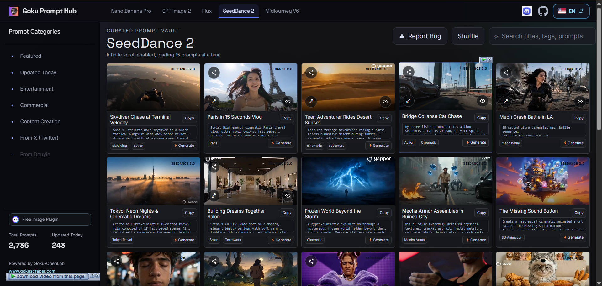

[English](./README.MD) | [简体中文](./README_zh.md)

# 🎞️ Seedance-2-prompts-datasets

[](https://huggingface.co/datasets/GokuScraper/seedance-2-prompts-datasets) [](https://creativecommons.org/licenses/by/4.0/) [](https://huggingface.co/datasets/GokuScraper/seedance-2-prompts-datasets) [](https://huggingface.co/datasets/GokuScraper/seedance-2-prompts-datasets)

> 🎞️ The ultimate Seedance-2 video prompt dataset (12GB+). 2000+ video generation prompts with full metadata and preview frames. Truly open source: No login, no ads, no redirection. Just pure data for AI video creators.

This project is a massive collection of prompts used for Bytedance's Seedance 2.0 and the resulting generated videos. The entire dataset exceeds **12GB** and contains **2000+ videos**, all structured into a comprehensive dataset.

Due to GitHub's limitations with large file storage, the full dataset is hosted on Hugging Face. The Hugging Face repository contains the generated **videos (.mp4)**, **cover images (.jpg)**, and a highly structured **.jsonl file** that holds all prompt metadata.

**Download the full dataset here:**  
[https://huggingface.co/datasets/GokuScraper/seedance-2-prompts-datasets](https://huggingface.co/datasets/GokuScraper/seedance-2-prompts-datasets)


## 🌐 Online Viewer
No login required, lighting-fast response.  
👉 **[View Online](https://prompthub.gokuscraper.com/)**



## 📖 Introduction
Launched by **GokuOpenLab**, **seedance-2-prompts-datasets** is a prompt data infrastructure project created for developers and researchers.

In the current AI ecosystem, prompts are the new "productivity interface". However, reality reveals several issues:
- Prompt data is highly fragmented.
- There is a lack of unified structural standards.
- Retrieving and reusing prompts is difficult.
- They are not suitable for engineering and systematic utilization.

This project's goal is NOT just to "display prompts", but to:
> Transform internet prompts into **structured, calculable, and redistributable data assets.**

## 🚫 Our Manifesto
Before building this project, we analyzed the absolute chaos in the open-source community and decided to firmly say "NO":
- **NO to black-box prompt distribution:** Closed systems that don't provide structured data and forbid secondary usage.
- **NO to traffic-driven pseudo-open source:** Repositories using GitHub as clickbait while hiding core data behind private platforms or logins.
- **NO to uncomputable data formats:** Simple text displays that cannot be parsed by programs or used for model training.

## ✨ Why Goku Prompt Hub?

### 1️⃣ 100% Open Data
All collected data is fully accessible. There are no "preview versions" or locked contents.
- Direct download via Hugging Face.
- Seamless online browsing.

### 2️⃣ Structured Data System (.jsonl)
Our prompt data is stored in a structured JSONL format. Every single prompt undergoes unified parsing and standardization, connecting the video assets to their exact configurations.

*Example entry from our JSONL records:*
```json
{
  "version": "1.0",
  "id": "SD2_00133",
  "category": "Entertainment",
  "is_featured": false,
  "date": "2026-04-28",
  "slug": "glacial-tiger-vs-frost-serpent",
  "model_info": { "name": "seedance", "version": "2.0" },
  "raw_p": "Environment: A colossal glacial canyon under pale blue twilight...",
  "media": {
    "v": "seedance-2/videos/SD2_00133.mp4",
    "c": "seedance-2/covers/SD2_00133.jpg"
  },
  "spec": { "width": 1280, "height": 720, "ratio": 1.78, "duration": 15.12, "safety_rating": "Safe for Work" },
  "i18n": {
    "zh": {
      "t": "冰谷虎蛇战",
      "p": "环境：一座巨大的冰川峡谷，笼罩在淡蓝色的暮光之下...",
      "tags": ["冰川峡谷", "冰虎", "霜蛇"]
    },
    "en": {
      "t": "Glacial Tiger vs Frost Serpent",
      "p": "Environment: A colossal glacial canyon under pale blue twilight...",
      "tags": ["ice canyon", "frozen battle", "cinematic"]
    }
  },
  "platform": "x",
  "sourceLink": "https://x.com/LudovicCreator/status/2045419585491317186",
  "file_name": "seedance-2/videos/SD2_00133.mp4"
}
```

### 3️⃣ Developer Friendly
- **Unified JSON Schema**: JSONL perfectly formats logs into lines of JSON objects.
- **Database Ready**: Seamlessly import into SQLite, Supabase, or your local AI toolchains.
- **One-line Python Integration**: Load the dataset directly into a Pandas DataFrame in 1 second:

```python
import pandas as pd

# Load Goku's dataset instantly!
url = "https://huggingface.co/datasets/GokuScraper/seedance-2-prompts-datasets/raw/main/metadata.jsonl"
df = pd.read_json(url, lines=True)
print(f"✅ Loaded {len(df)} structured video prompts!")
```


### 4️⃣ Open License (CC BY 4.0)
All data operates under the **CC BY 4.0 License**:
- ✔ Free to use
- ✔ Commercial use allowed
- ✔ Modification allowed
- ✔ Redistribution allowed
- ❗ **Attribute original source required**

## 📊 Data Overview
- **Total Prompts:** 2110+
- **Languages:** English / Chinese
- **Target Models / Engines:** Bytedance Seedance 2.0, Midjourney, Stable Diffusion, DALL·E 3, Flux, etc.
- **Update Frequency:** Continuous automated syncs.

## 🛡️ Disclaimer
The prompts and metadata in this repository are sourced from public internet communities and are strictly intended for learning, research, and data structuring purposes.  
The copyright of the original generated content belongs to the original creators. This project only provides data curation, structured processing, classification, and indexing; it does not claim copyright over the original context.

If you are a copyright holder and believe there is an issue, please contact us via GitHub Issues or email. This project is not affiliated with Bytedance, OpenAI, Google, Anthropic, Midjourney, or any other specific model/platform.

## 🤝 Contributing
Welcome to Goku Prompt Hub!
- **Submit an Issue:** Report bad quality or broken prompts.
- **Submit a PR:** Contribute your high-quality prompt data.
- **Star the repo:** Show your support and push prompt data infrastructure forward!

---
*Happy Prompting!*


<!-- STATS_START -->

## 📊 Statistics
- Total Prompts: **8834**
- Updated Today (UTC 2026-10-06): **0**

## 🎬 Today's Updates
### 🎬 Louis Vuitton California Dream Commercial
<br>
<a href="https://prompthub.gokuscraper.com/en/seeddance2/prompt/louis-vuitton-california-dream-SD2_11996">🌐 Watch Online</a>

#### 📝 Prompt
```
LOUIS VUITTON "CALIFORNIA DREAM" EDP 100ML — 30-Second Commercial Video Prompt Phase 1: Visual & Sensory Asset Definition Product: Louis Vuitton California Dream flacon. Clear heavy-base glass bottle with a signature ombré fragrance liquid — aqua-teal at the shoulder melting into soft blush-pink at the base. Glossy black stepped cylindrical stopper. Crisp black debossed/printed lettering "CALIFORNIA DREAM" above "LOUIS VUITTON." Packaging box in matching teal-to-coral-pink gradient with pink "CALIFORNIA DREAM" script and black "LOUIS VUITTON" wordmark. Subject (Heroine): A tall, slim, high-fashion model with an editorial runway physique. Sun-kissed, dewy, luminous skin — fresh and glowing, never matte. Sparkling emerald-green eyes that catch and hold the light in every close-up. Soft waved hair loose and wind-swept. She wears a flowing, silk sunset-coral/burnt-orange halter gown — a color chosen to sit in warm contrast against the bottle's cool blue-to-pink palette — with delicate gold ring hardware at the waist. Environment: California pier/boardwalk at golden hour into dusk — weathered wood planks, a pale wooden cross-beam silhouette in the background, soft lavender-peach sky, distant hazy shoreline, gentle sea breeze. Pacing: 30-second fluid runtime, continuous camera glides, soft cross-blur transitions, zero jitter, rhythmic build to a hero close on the final beat. Phase 2: Shot-by-Shot Timeline @sheet is the visual truth for product and subject in every shot: [PRODUCT LOCK — clear glass flacon, thick base, teal-to-pink ombré liquid, glossy black stepped stopper, black lettering "CALIFORNIA DREAM" above "LOUIS VUITTON"]. [SUBJECT LOCK — tall, slim, fashion-model heroine, glowing fresh skin, sparkling emerald-green eyes, wind-swept waved hair, flowing coral-orange silk halter gown with gold ring hardware]. Keep flacon and subject identical across all shots. [00:00.0] Wide establishing shot, low angle from the boardwalk planks. Golden-pink sunset sky, silhouette of the wooden pier cross-beam. Camera glides slowly forward along the weathered wood toward a soft focal point in the distance. [00:02.5] Medium shot, eye-level. The @sheet heroine walks barefoot along the sun-warmed boardwalk, coral gown catching the breeze, her emerald eyes glinting as she glances toward camera. Camera tracks alongside her in a smooth lateral glide. [00:05.0] Close-up, eye-level. Her face in profile, dewy skin lit by warm rim light, green eyes sparkling as she closes them briefly, a small content smile. Loose hair drifts across her cheek. Camera holds with a gentle micro push-in. [00:07.5] Extreme close-up, flat-on. The @sheet flacon cradled in her hand, sunlight refracting through the teal-to-pink ombré liquid, "CALIFORNIA DREAM" lettering crisp and legible. Camera drifts in a slow arc around the glass. [00:10.0] Medium-wide, three-quarter angle. The heroine lifts the bottle toward the horizon, coral fabric billowing against the blue-pink sky — a striking color contrast between gown and bottle. Camera pulls back with continuous fluid motion. [00:12.5] Macro shot, high angle looking down. Sea mist droplets and a scatter of citrus slices and pink sand grains resting beside the flacon on wet wooden planks. Soft golden side light. Camera glides right to left. [00:14.5] Ultra-macro, flat-on. A slow-motion burst of the ombré liquid — teal swirling into blush-pink with fine suspended micro-bubbles, fully backlit and glowing. Camera holds with a subtle rotating drift. [00:17.0] Close-up, eye-level. The heroine's green eyes open directly to camera, sparkling with warm sunset catchlight, a soft exhale of confidence. Camera tilts up slowly from her collarbone to her gaze. [00:19.5] Medium shot. She spritzes the @sheet perfume into the golden air, fine mist catching the light like scattered gold dust, coral gown swaying. Camera circles smoothly around her. [00:22.0] Wide shot, horizon at eye-level. The heroine stands tall and poised on the reflective wet boardwalk as dusk deepens, sky shifting into lavender and deep ocean blue, her silhouette elegant and slim. Camera holds a slow cinematic push-in. [00:24.5] Abstract transitional shot. Coral silk fabric flutters in slow motion intercut with liquid-glass light refractions, streaking softly into blue and pink. Camera whips gently sideways. [00:26.0] Medium hero shot, centered, eye-level. The full @sheet flacon held in sharp focus in the foreground, heroine soft-focus behind it, emerald eyes still catching light, radiant sunset halo behind her. "CALIFORNIA DREAM" and "LOUIS VUITTON" lettering perfectly crisp and legible. Camera glides slowly forward. [00:28.5–00:30.0] Final settle. Glow builds gently around the bottle, light flare blooms softly across frame, then fades to warm black. No text overlay, no end card — clean cinematic fade. Phase 3: Audio & Sound Design Background Music: Warm, airy ambient pop-electronic score — soft piano arpeggios layered over a mellow analog synth pad, gentle four-on-the-floor pulse building from :00 to :22, then a light emotional swell with a soft string layer into the hero shot, resolving on a warm sustained chord at :30. Sound Effects: Gentle ocean waves and boardwalk creak ambience throughout Soft breeze/fabric flutter sound synced to gown movement (:02.5, :10.0, :24.5) Crisp glass-chime "ting" as the bottle catches light (:07.5) Light citrus-fizz/bubble sound layered under the liquid macro shot (:14.5) Airy perfume mist spray sound, copyright and high-fidelity (:19.5) Soft ambient hush and gentle low sub-swell on the final glow (:28.5–:30.0) Aspect Ratio: 16:9 Total Duration: 30 seconds Style: Continuous fluid camera glides, seamless cross-blur transitions, cinematic warm-golden color grade, no jitter cuts.
```

#### 📌 Details
- Ratio: `1.78` | Duration: `30.08s`

---

### 🎬 Luxury Lip Tint Squeeze Shot
<br>
<a href="https://prompthub.gokuscraper.com/en/seeddance2/prompt/luxury-lip-tint-squeeze-SD2_11983">🌐 Watch Online</a>

#### 📝 Prompt
```
use the attached girl as character Absolutely — the product squeeze shot can make the UGC feel much more satisfying and premium. I’d place it right before application so viewers see the actual tint texture coming out. # 10-Second Studio-Level UGC Video Prompt FORMAT: 15 seconds \| 9:16 vertical \| 4K \| 24fps \| ultra-photorealistic \| premium studio UGC \| luxury beauty campaign PRODUCT REFERENCE: Use the attached Rhode Peptide Lip Tint image as the absolute product reference. Preserve the exact tube shape, dusty rose-pink color, cap, proportions, and packaging details. No redesign or label changes. 0–2s — THE HOOK A beautiful young woman in a minimal luxury beauty studio holds the exact lip tint close to the camera. She looks directly into the lens with a subtle confident smile and says: “Okay… this is my new lip obsession.” Soft diffused daylight, warm neutral background, shallow depth of field. 2–4s — THE SATISFYING SQUEEZE Extreme macro product shot. She gently presses the middle of the tube with her fingers. The product comes out smoothly and beautifully from the applicator opening in a clean, controlled, glossy ribbon of tinted balm. Capture the moment in slow motion with realistic creamy texture, subtle shine, and beautiful studio highlights. The camera stays extremely close to the tube, showing the product texture clearly. Important: The product must dispense naturally from the correct opening. No excessive amount, splashing, floating product, or unrealistic deformation of the tube. 4–6.5s — THE APPLICATION Cut to a close-up of her lips. She smoothly applies the tint to her lower lip, then glides across the upper lip. The tint visibly adds a soft rosy-mauve wash with a hydrated glossy finish. Natural lip texture and realistic product movement. 6.5–8s — THE REACTION She looks into the camera, presses her lips together gently and smiles. She says: “Look at that tint.” A subtle head turn catches the studio light across her glossy lips. 8–10s — THE HERO SHOT Transition into a beautiful luxury product shot. The exact Rhode Peptide Lip Tint stands upright on a warm beige studio surface with a soft reflection underneath. The camera slowly pushes toward the product while a soft highlight moves across the tube. On-screen text: PEPTIDE LIP TINT Your lips, but better. VISUAL STYLE: Studio-level beauty commercial meets authentic UGC. Soft cinematic lighting, warm beige environment, realistic skin pores, natural lip texture, elegant hand movements, macro product photography, shallow depth of field, premium reflections, smooth camera motion, subtle filmic contrast. PRODUCT LOCK: Keep the attached product visually identical in every shot. Do not change the packaging, color, typography, proportions, cap, or shape. No product morphing, no duplicate products, no distorted hands, no warped tube, no artificial colors.
```

#### 📌 Details
- Ratio: `1.75` | Duration: `15.21s`

---

### 🎬 Korean Sunscreen Cinematic Ad
<br>
<a href="https://prompthub.gokuscraper.com/en/seeddance2/prompt/korean-sunscreen-ad-SD2_11976">🌐 Watch Online</a>

#### 📝 Prompt
```
Extreme macro close-up shot of an East Asian woman's eye with dewy skin, dramatic natural sunlight casting sharp shadows across her face. Direct cut to a low-angle medium shot outdoors under a bright blue sky, the woman standing between flowing, semi-translucent white fabric curtains, extending a minimalist beige Korean sunscreen tube directly toward the camera lens. Cut to an ultra-close macro shot of her applying a smooth swipe of white cream to her cheekbone. Soft organic motion, sheer white drapes billowing in a gentle breeze, artistic window shadows playing on her radiant, glass-like skin. Minimalist Korean skincare commercial aesthetic, hyper-detailed skin texture, elegant, serene, luxury studio lighting, high-contrast natural light, cinematic warm color grade, 8k resolution, photorealistic, 24fps.
```

#### 📌 Details
- Ratio: `1.78` | Duration: `10.04s`

---

### 🎬 Seedance Mecha Cinematic Awakening
<br>
<a href="https://prompthub.gokuscraper.com/en/seeddance2/prompt/seedance-mecha-awakening-SD2_11971">🌐 Watch Online</a>

#### 📝 Prompt
```
Seedance 2.5 — Cinematic sci-fi mecha short film, photorealistic CGI, Hollywood VFX blockbuster style, moody teal-and-orange color grade, volumetric light, 16:9, 60fps motion clarity, anamorphic lens flares. SHOT 1 (0-3s): Extreme close-up, low angle, shallow depth of field. Worn yellow leather work boots step slowly through a dark, dripping mechanical corridor. Thick rusted cables and hydraulic pipes cover the walls. Cold blue rim light, wet reflective floor, dust particles drifting in the air. SHOT 2 (3-9s): Slow dolly-back reveal down a circular blast-door tunnel, ribbed metal walls covered in hanging cables converging toward a bright glowing exit. Abandoned, atmospheric, sci-fi bunker aesthetic. Hold long enough to build dread before the reveal. SHOT 3 (9-15s): A massive white-and-black bipedal combat mech powers on, its single orange visor-eye flickering to life, and strides forward through the tunnel opening toward camera, backlit by blown-out daylight. Steam vents from its joints with each step. Heroic low-angle hero shot, slow motion emphasis on the third step. SHOT 4 (15-18s): POV close-up of a young female pilot, short white/silver hair, blue flight jacket, tactical earpiece, looking up in determined awe at the towering mech above her, tunnel light reflecting in her eyes. SHOT 5 (18-21s): Extreme macro close-up on the mech's mechanical hand — articulated white-and-black armor plating, a red reactor core igniting and pulsing with light between its fingers, sparks and lens flare. SHOT 6 (21-24s): Tracking shot from behind the pilot as she walks toward the mech, which reaches a hand down to receive her, backlit silhouette against bright sky. SHOT 7 (24-33s): Dynamic tracking side shot — the mech bursts into a full sprint down a devastated, rubble-strewn city street, heavy motion blur, camera shake, debris kicked up with each heavy footstep, collapsed buildings on both sides. This is the longest, highest-energy shot — building momentum toward the climax. SHOT 8 (33-38s): First-person cockpit POV — inside the mech's head, red-orange holographic HUD with crosshair reticle, health/ammo bars, targeting brackets locking onto a distant humanoid enemy standing amid rubble at the end of a ruined street, faint laser targeting line, HUD glitch flicker. SHOT 9 (38-42s): Low worm's-eye-view finale — the mech lands hard from a jump, camera whip-pans up past its legs as a massive shockwave of dust, smoke and debris explodes outward in all directions, tiny human silhouette visible far below for scale. Orange cockpit glow visible through the smoke. Hard cut to black on impact for a punchy ending. Audio: deep bass impacts, servo/mechanical whirs, distant wind, tense orchestral rise building to a percussive hit on the final landing, sudden silence on the cut to black. Camera: mix of static close-ups, slow reveals, and fast tra
```

#### 📌 Details
- Ratio: `1.78` | Duration: `42.07s`

---

### 🎬 Cinematic Deep Sea Whale Tide
<br>
<a href="https://prompthub.gokuscraper.com/en/seeddance2/prompt/cinematic-deep-sea-whale-tide-SD2_11964">🌐 Watch Online</a>

#### 📝 Prompt
```
generate 15-Second Cinematic Scene. Main subject: Deep sea, pure cinematic weather — soft golden-blue dusk light breaking through parting storm clouds, mist hovering over the surface, calm after-storm atmosphere. Hyper-realistic ocean VFX, IMAX-quality detail, no clipping, no morphing, no warping, no frame stutter, no visual errors. Tone: awe, scale, quiet wonder — not action. 0:00–0:02 — Opening Frame Wide aerial shot, camera high above the ocean. Storm clouds in the upper third, beginning to part. Deep indigo water below, first shaft of golden light breaking through center-right. Small wooden pirate ship a distant silhouette, bottom third of frame. Camera static. Fine ripple texture, realistic light reflection. 0:02–0:04 — Descent Begins Camera slowly descends and pushes toward the ship. Golden light spreads across more of the surface. Ship clearer now — sails slightly damp, hull rocking gently on low swell. Mist low on the horizon. Smooth, continuous glide, no cuts. 0:04–0:06 — The Whale Passes Beneath Camera shifts to a semi-underwater angle at the waterline. Just below the surface, a colossal grey-blue shape glides past beneath the ship — barnacled, ancient, moving slowly. Sunbeams pierce down through the water, lighting its silhouette. Surface remains calm for now, only a faint ripple betraying the shape below. 0:06–0:08 — The Tide Begins to Rise Camera back to the ship's deck, wide angle. Behind the ship, the ocean surface begins swelling upward — not a wave breaking, but a smooth, massive wall of water rising like a moving tide, glassy and golden-lit. Crew turns to look, calm and still, hands lightly on the rail. The rising tide fills more of the frame with each passing moment, dwarfing the ship. 0:08–0:10 — The Tide Wall Fully Forms The tide is now a towering, smooth wall of amber-gold water stretching across the horizon behind the ship, cresting slowly but never breaking violently. Light ripples across its glassy surface. Mist drifts along its base. The ship sits small and steady in the foreground, sails catching a light gust as the swell begins to lift it. 0:10–0:12 — The Whale Breaches Through the Tide As the tide crests, the blue whale breaches directly through the face of the rising water wall in slow motion — water sheeting off its back in silver curtains, blowhole releasing a tall mist plume that catches the golden light. The tide and the whale move as one continuous surge. Ship rises smoothly on the swell, cradled, not thrown. 0:12–0:14 — Tide Crests Around the Ship Camera slowly orbits as the tide reaches its peak height around the ship, the whale's body arcing back down into the water. Ship rides along the face of the tide, sails full, crew silhouetted against the towering wall of water. Serene and majestic — no crashing, no spray, just smooth, immense motion. 0:14–0:15 — Settle and Fade The tide begins to smooth
```

#### 📌 Details
- Ratio: `2.29` | Duration: `15.17s`

---

### 🎬 Train Zombie Outbreak Panic
<br>
<a href="https://prompthub.gokuscraper.com/en/seeddance2/prompt/train-zombie-outbreak-SD2_11921">🌐 Watch Online</a>

#### 📝 Prompt
```
Shot 1 (0–1.2s): Character matching reference image, seated on a stopped train, feverish and sweating as red checkpoint lights sweep outside. Shot 2 (1.2–2.4s): Soldiers and officials board, inspecting passengers with flashlights while everyone watches nervously. Shot 3 (2.4–3.6s): Close-up of her trembling hand; veins darken beneath her skin as her breathing becomes shallow. Shot 4 (3.6–4.8s): Official checks documents and stops beside her, unaware of the danger. Shot 5 (4.8–6s): Her eyes cloud white and her head tilts unnaturally toward him. Shot 6 (6–7.2s): She suddenly bites his arm; extreme close-up, shocked reaction, cinematic slow motion. Shot 7 (7.2–8.4s): Passengers scream and retreat as the injured official stumbles into the aisle. Shot 8 (8.4–9.6s): His bite wound rapidly develops branching dark veins as the infection spreads. Shot 9 (9.6–10.8s): Soldiers outside notice the chaos through the windows and raise the alarm. Shot 10 (10.8–12s): The official convulses violently under flickering lights. Shot 11 (12–13s): His eyes snap open bloodshot and empty—the transformation complete. Shot 12 (13–14s): He attacks a nearby passenger, triggering mass panic inside the confined car. Shot 13 (14–15s): Passengers rush for the doors, but soldiers outside slam and lock them shut. Shot 14 (15–16.2s): Soldier seals the exterior lock as passengers pound desperately on the glass. Shot 15 (16.2–17.4s): Wide view: passengers realize they are trapped inside the sealed train car. Shot 16 (17.4–18.6s): A newly bitten passenger transforms within seconds and attacks others. Shot 17 (18.6–19.8s): Survivors retreat toward the back, trapped between sealed doors. Shot 18 (19.8–21s): A passenger grabs a fire extinguisher and braces against the approaching infected. Shot 19 (21–22.2s): He blasts them with white extinguisher spray, filling the car with fog. Shot 20 (22.2–23.4s): Soldiers watch silently from outside with weapons raised, unsure whether to intervene. Shot 21 (23.4–24.6s): Fully infected character presses against the sealed door glass while survivors corner themselves. Shot 22 (24.6–25.8s): Survivors barricade inside a restroom as pounding and screams echo outside. Shot 23 (25.8–27s): Wide shot of infected and survivors battling inside the sealed car beneath harsh checkpoint lights. Shot 24 (27–28.2s): Soldier radios for backup as the train rocks from the chaos within. Shot 25 (28.2–30s): Exterior wide shot: motionless train at the checkpoint, sealed doors, fogged windows and silhouettes struggling inside trapped-horror ending.
```

#### 📌 Details
- Ratio: `1.78` | Duration: `30.08s`

---

### 🎬 Armored Alien Battles Female Warrior
<br>
<a href="https://prompthub.gokuscraper.com/en/seeddance2/prompt/armored-alien-female-warrior-battle-SD2_11912">🌐 Watch Online</a>

#### 📝 Prompt
```
Ultra-realistic cinematic sci-fi horror scene of a massive armored alien creature with glowing red eyes, enormous sharp fangs and powerful claws roaring aggressively in a dark futuristic battlefield. A mysterious female warrior descends from the sky above the creature, surrounded by intense orange energy trails and glowing sparks. Dramatic blue night lighting, smoke-filled atmosphere, rain, metallic structures, volumetric fog, dynamic action composition, terrifying scale, highly detailed creature textures, realistic reflections, cinematic depth of field, epic Hollywood movie style, photorealistic, 8K, vertical 9:16.
```

#### 📌 Details
- Ratio: `1.78` | Duration: `15.13s`

---

### 🎬 Serene Summer Watermelon Girl Countryside
<br>
<a href="https://prompthub.gokuscraper.com/en/seeddance2/prompt/summer-watermelon-girl-countryside-SD2_11911">🌐 Watch Online</a>

#### 📝 Prompt
```
A graceful young Korean woman with soft short wavy brown hair, delicate features, gentle smiling eyes and a warm serene expression, wearing a light straw hat with frayed edges and a sleeveless white floral summer dress with subtle small patterns that flows lightly around her body, holding a juicy red watermelon slice near her face in soft golden sunlight by a wooden window, then walking carefully across smooth river stones in white flat shoes while carrying a woven basket filled with watermelon pieces, crouching by the clear shallow stream to gently place and cool a whole striped watermelon in the water with both hands while smiling, standing on a wooden balcony railing adjusting her straw hat with a soft smile, walking along a sunlit riverside path among tall bright yellow sunflowers while turning to look at them and then smiling at the camera, and finally standing on a traditional wooden porch with a hanging glass wind chime, holding a glass milk bottle, adjusting her hat and hair, looking up peacefully then turning to face the camera with a gentle radiant smile, all in a soft cinematic summer countryside atmosphere with warm natural light, green leaves, flowing water, and peaceful nostalgic mood.
```

#### 📌 Details
- Ratio: `1.74` | Duration: `19.0s`

---

### 🎬 High Fashion Editorial Film
<br>
<a href="https://prompthub.gokuscraper.com/en/seeddance2/prompt/high-fashion-editorial-film-SD2_11908">🌐 Watch Online</a>

#### 📝 Prompt
```
Create a 15-second high-fashion editorial film starring the adult female character in @[char ref]. Preserve her exact face, hairstyle, body proportions, skin tone, outfit, accessories, and visual style. Use the reference as the ONLY character
```

#### 📌 Details
- Ratio: `1.78` | Duration: `15.03s`

---

### 🎬 Cinematic Gouache Concept Art Animation
<br>
<a href="https://prompthub.gokuscraper.com/en/seeddance2/prompt/cinematic-gouache-animation-SD2_11902">🌐 Watch Online</a>

#### 📝 Prompt
```
#1: Cinematic 2.5D animation in the style of fully painterly rendering, characters and environments look like gouache concept-art paintings in motion, visible brush texture on skin, cloth and buildings, flat posterized color blocks with hard-edged light
```

#### 📌 Details
- Ratio: `1.78` | Duration: `29.3s`

---

### 🎬 Sea Otter Mother and Pup Morning Bond
<br>
<a href="https://prompthub.gokuscraper.com/en/seeddance2/prompt/sea-otter-morning-bond-SD2_11898">🌐 Watch Online</a>

#### 📝 Prompt
```
30 seconds, 16:9, BBC Planet Earth nature documentary style, 8K ultra-realistic wildlife cinematography. Morning sunbeams pierce mist above a calm Pacific kelp cove. A mother sea otter floats peacefully on her back in emerald water, wrapped in bull-kelp leaves, while her tiny fluffy 2-week-old pup sleeps safely on her chest. Natural telephoto optics, 200mm lens, shallow depth of field, crystal water sparkles.

0:00-0:06: Low water-level telephoto tracking shot. Sunlight catches droplets on the mother's dark wet fur as she gently licks her pup's head. The pup stretches its tiny paws and lets out a soft squeak.

NARRATION (warm, gentle documentary voiceover): \"Here, in the quiet shelter of the kelp forest, morning begins with a mother's embrace.\"

0:06-0:12: Close-up on the pup yawning, its pink tongue visible, fluffing its dense cream-colored chest fur with tiny paws. The mother uses her paws to anchor them to a golden kelp frond.

NARRATION: \"For this two-week-old pup, her mother's chest is the safest island in the vast ocean.\"

0:12-0:18: Gentle 90-degree floating orbit around the otters. Golden light-caustics dance across the clear emerald water beneath them. A gentle swell lifts them softly.

NARRATION: \"Together, wrapped in living kelp, they ride the gentle rhythm of the sea.\"

0:18-0:24: Tight macro shot on the pup nuzzling the mother's cheek. The mother wraps both forepaws around her pup, closing her eyes in serene contentment.

NARRATION: \"A bond forged in warmth, drift, and quiet devotion.\"

0:24-0:30: Slow crane rise upward revealing the full sunlit kelp cove, distant pine-covered cliffs in soft morning fog, the otter pair reduced to a cozy center-frame focal point.

NARRATION: \"Another peaceful day dawns in the kelp kingdom.\"

SOUND: Soft ocean lap, gentle splash, tiny otter pup squeak, mother's breathing, kelp rustle, warm British documentary narration.

LOCKS: Natural fur physics, realistic water dynamics, no human objects, stable horizon, professional wildlife color grading.

NEGATIVE: No captions, text, logos, watermark, background music, cartoon eyes, exaggerated color saturation, extra animals.
```

#### 📌 Details
- Ratio: `2.3` | Duration: `30.04s`

---

### 🎬 One Click Video Editing With VEED
<br>
<a href="https://prompthub.gokuscraper.com/en/seeddance2/prompt/one-click-video-editing-veed-SD2_11897">🌐 Watch Online</a>

#### 📝 Prompt
```
A single, unbroken continuous take (no cuts) from the perspective of a smartphone camera. Digital camera quality, casual vlog aesthetic, slightly soft focus, not too sharp, with natural handheld camera shake. NO BACKGROUND MUSIC. Phase 1: The Selfie Walk (0:00 - 0:08) The video begins in a close-up selfie angle. A young woman with long wavy brown hair, wearing a brown corduroy newsboy cap, a green cardigan over a white graphic top [REF] is walking through a lush green park with people relaxing on the grass and a city skyline in the background under an evening sky [REF] . She holds the camera with one hand and holds a pearl white DJI Mic with a fluffy white windscreen [REF] close to her mouth with the other. She speaks directly to the lens with a casual expression, her lips syncing to: "I used to spend HOURS every day editing just one video… only to end up burnt out." Phase 2: The Set Down (0:08 - 0:15) In one continuous motion without cutting, the camera perspective tilts down as she [REF] lowers her arm and places the phone down on the grass, propping it against a tree base. She then walks backward away from the camera, revealing a full-body wide shot of her green pleated skirt and brown leg warmers/boots [REF] . She stands in the middle of the park, briefly glances around at the scenery, then brings the white DJI mic [REF] back up to her mouth with renewed energy. She speaks, her lips syncing to: "Until I found VEED. Finally, all I need is just one click and it's DONE!" Phase 3: The Wrap Up (0:15 - 0:20) Still in the same unbroken shot, she [REF] smiles brightly and jogs forward back towards the camera lens. She leans down and picks the phone back up, fluidly transitioning the angle back to a close-up selfie mode. Holding the white DJI mic [REF] in her other hand, she looks into the lens and speaks, lips syncing to: "You should give it a try, guys! Bye!" She gives a cheerful wave to the camera as the video ends.
```

#### 📌 Details
- Ratio: `0.56` | Duration: `18.27s`

---

### 🎬 Golden Hour Alley Cat Encounter
<br>
<a href="https://prompthub.gokuscraper.com/en/seeddance2/prompt/golden-hour-alley-cat-encounter-SD2_11896">🌐 Watch Online</a>

#### 📝 Prompt
```
Create a 15-second realistic cinematic slice-of-life video in 16:9, 24fps. Visual-only video, no dialogue, no voice, no music, no sound effects, no subtitles, no text on screen. Warm golden-hour sunlight, soft handheld camera, muted film color grade, slight grain, natural shadows, peaceful nostalgic neighborhood mood. Fully realistic live-action style, not game-like, not animated. Main character: a young Korean woman in her early 20s with messy dark brown hair tied in a loose ponytail, soft natural face, calm gentle expression, dark gray cropped sleeveless tank top, loose light-wash blue jeans, black necklace, casual sneakers. Keep her look consistent in every shot. Location: a long narrow real-life residential alley between tall tan stone and concrete walls. Sandy dusty ground, warm sunlight glowing on one side, soft tree shadows across the path, palm trees and green leaves visible above the walls, a blue painted wall far ahead, one bicycle leaning near the end of the alley, quiet empty neighborhood feeling. 0:00–0:02: Rear tracking shot. The Korean woman walks slowly through the long narrow alley from behind. Golden sunlight stretches across the tan walls. Camera follows with natural handheld motion. 0:02–0:04: Wide alley shot. A small gray-brown tabby cat appears from a low gap near the left side wall and steps into the alley. The woman notices it, slows down, and turns slightly toward it. 0:04–0:06: Medium side shot. The cat walks near her feet and looks up. She smiles softly, bends down slowly, and extends one hand in a gentle careful way. 0:06–0:08: Low close-up. The cat sniffs her fingers, then rubs its head against her hand. She gently pets the cat’s head and back. Show realistic fur texture, tiny whisker movement, and natural cat behavior. 0:08–0:10: Emotional close-up. The woman smiles warmly while petting the cat. Sunlight flickers through tree leaves across her face, shoulders, and hair. Keep the moment soft, calm, and human. 0:10–0:12: Medium-wide shot. The cat walks ahead a few steps, then looks back at her. She stands slowly and follows it with a curious peaceful smile. 0:12–0:14: Front tracking shot. She walks toward camera with the cat beside her near the wall. She looks down at the cat and smiles. The long alley, tan walls, blue wall far behind, trees, and bicycle remain visible. 0:14–0:15: Final close shot. The cat brushes against her leg. She looks toward the camera with a soft peaceful smile, then looks down at the cat again. Hold the warm golden alley atmosphere for a gentle cinematic ending.
```

#### 📌 Details
- Ratio: `1.78` | Duration: `15.08s`

---

### 🎬 Ice Block Dropped Into Active Lava
<br>
<a href="https://prompthub.gokuscraper.com/en/seeddance2/prompt/ice-block-lava-drop-SD2_11895">🌐 Watch Online</a>

#### 📝 Prompt
```
【Style】 A realistic, vertical-screen documentary short video of extreme adventure, shot with a handheld, wide-angle camera. Real people, real cabin interior, refraction and internal cracks in transparent ice, black volcanic rock, and orange-red lava. Preserves handheld shakiness, flight vibrations, natural motion blur, and exposure variations. The cabin is dark, while the sky outside is bright, with lava casting orange-red reflections onto the characters&#39; arms, ice blocks, and door sills. The final eruption uses realistic cinematic effects, with the white gas column possessing three-dimensional layers, volume, and swirling details. 【Duration】 15 seconds, 9:16 vertical screen, one continuous shot throughout. Real-time action, no cuts, no slow motion, and no insertion of other camera angles. 【Scene】 A helicopter hovers above a volcanic lava field, its side door fully open. The camera is positioned inside the cabin, near the open door, filming the people at the door and outside. Dark door frames and cabin walls are visible on the left and top of the screen, while below are dark gray non-slip textured flooring, metal door sills, and fasteners. Below the cabin is a large expanse of dark gray-black solidified lava crust, its surface dotted with meandering, glowing orange-red cracks. These cracks surround a nearly circular, bright lava pool, within which golden and orange-red molten material slowly churns, forming localized bubbles, bright spots, and cracked dark hulls. A thin layer of gray smoke flows along the surface. This circular lava pool, located below the cabin door, became the same point of impact for the falling ice and subsequent gas column eruptions. [Character] An adult East Asian woman with long brown hair tied in a ponytail, wearing a windbreaker, gray-green overalls, and dark boots. She wears a black safety harness and an aviation headset with a microphone. Her hair is constantly blown to her side and back by the strong winds outside the cabin door. She appears relaxed at the beginning, smiling at the camera before turning her attention outside; at the end, startled by the white gas column, she quickly bends over and retreats into the cabin. The character remains inside the cabin throughout, with only her arms and ice blocks extending out of the door; she does not jump out of the helicopter. [Core Prop] A single, massive, transparent rectangular block of ice, extending approximately from the woman&#39;s chest to her knees, its width nearly equal to the width of her torso. The ice is thick, with clearly defined top, front, sides, and thickness; the edges are slightly melted, and the interior contains milky white ice mist, tiny bubbles, and irregular cracks; the surface is moist. The woman holds the ice block with both hands on either side, her forearms supporting it, conveying its weight. The ice block remains upright while being held; after being pushed out of the hatch, it tilts and falls, only slightly flipping, not breaking into thin glass, plastic bags, liquid, or multiple fragments. [Camera] The opening is a close-up, handheld medium shot, with the woman on the left side of the frame, the massive ice block slightly to the right of center, and the bright space outside the hatch in the background on the right. The camera is about one meter away from the woman, simultaneously showing her head, torso, bent legs, and the intact ice block. After the ice block is released, the camera rotates to the lower right and shoots downwards, its gaze passing over the threshold, continuously tracking the ice block&#39;s descent. The camera remains at the hatch, not flying out with the ice block. The camera then maintains a high vantage point overlooking the lava pool, before quickly retreating back into the cabin as the plume of air approaches. [00:00–00:01.30] Camera Movement 1: Embracing the Giant Ice Block, Smiling at the Camera. A woman stands sideways beside the open cabin door, her feet staggered, knees slightly bent. A huge rectangular block of ice stands upright in front of her chest and abdomen, its base suspended above the floor. She grips the sides of the ice block with both hands, her elbows bent, holding it securely in front of her. She looks at the camera, a brief, relaxed, and excited smile playing on her lips. The wind blows her ponytail and loose hair to the left and back. The ice block sways slightly with the vibrations of her arms and the fuselage, but maintains its shape. The ice surface reflects the bright sky, and the white ice patterns inside are clearly visible. The camera maintains a close-up medium shot, slightly handheld and shaky, with the gray-black volcanic landscape visible on the right. Sound effects: continuous helicopter rotor noise, cabin vibration, and wind noise from the cabin door. [00:01.30–00:02.30] Camera Movement 2: Turning her head to look at the landing point, the woman bends her knees and shifts her center of gravity, withdrawing her gaze from the camera. She first turns her head to look outside the cabin on the right, then looks down at the lava pool below. Her shoulders and torso follow, turning towards the hatch, her legs bending further, lowering her center of gravity. She moves the ice block from close to her chest and abdomen outwards, her arms gradually extending, the bottom of the ice block near the metal threshold. She doesn&#39;t throw it suddenly, but with a noticeable sense of weight, slowly and continuously sending the entire block of ice out of the cabin. The side of the ice block facing the lava gradually turns orange-red, while the side facing away from the lava remains cold white and transparent. The camera begins to tilt slightly to the right and downwards, making the ice block and threshold the focus of the shot. Sound effects: Continuous rotor noise, the sound of clothing and safety harnesses rubbing together, and the character exhaling sharply. [00:02.30–00:03.10] Camera Action 3: Pushing over the threshold, the woman leans forward with her knees bent, her arms continuing to extend outwards, shifting the weight of the ice block over the threshold. The ice block initially remains nearly vertical, then tilts its top outwards and its bottom detaches from the doorway area. She straightens her arms, releasing her fingers one by one, allowing the ice block to completely leave her hands. After releasing, her palms briefly remain in the air before retracting. The ice block begins to fall outwards and downwards, its top surface slightly rotating, remaining a single, thick rectangular block. The camera immediately pans downwards along the direction of the ice block&#39;s movement, the woman&#39;s face disappearing from the frame, only her arms briefly remaining in the upper left corner; the threshold and non-slip floor remain in the lower foreground of the frame. Sound effects: Increased wind noise, sustained low-frequency rotor sounds, no added glass-breaking sounds. [00:03.10–00:04.60] Camera Movement 4: The ice block moves away, with an overhead shot tracking its trajectory. The ice block rapidly changes from a close-up of the entrance to a small cuboid below the cabin, approaching the circular lava pool along a continuous descent path. The ice block tilts and flips slightly, its top and sides reflecting light alternately. The downward-facing side is illuminated by the lava, turning pinkish-orange, while the edges remain translucent, cool white. The camera continues to pan downwards, moving the bright circular lava pool to the center of the frame. A slanted metal threshold is retained in the lower left corner to help the audience understand that the camera is still on the helicopter. The ice block shrinks as it moves further away, eventually becoming a small, light-colored object above the bright lava area, and is obscured by light and molten material after contacting the churning surface. A large plume of air should not be ejected immediately upon contact; the subsequent waiting process must be preserved. Sound effects: rotor sounds, high-altitude wind sounds, and low-pitched volcanic ambient sounds. [00:04.60–00:08.20] Camera Movement 5: Maintaining an overhead view, lava churns, and delayed-reaction ice has disappeared from the frame. The camera continues to look down at the same nearly circular lava pool, the lens slightly zooming in towards the center, the foreground threshold gradually receding, leaving only the ground and lava. Orange-red molten material slowly churns within the pool, bright yellow textures constantly changing shape; thin, dark hues are torn apart, forming irregular bright seams, and small waves occasionally rise from the pool&#39;s edge. The surrounding black crust and fine red cracks remain fixed in place, and thin gray smoke drifts slowly by. This section should present a clear sense of anticipation: the impact point continues to churn, but there is no tall eruption column yet. The camera does not cut away or rewind to show the characters, maintaining suspense with slight handheld vibrations. Sound effects: continuous rotor noise, low churning sound of lava, no loud explosions yet. [00:08.20–00:11.50] Camera Movement 6: A small white cloud appears, intermittently rising and gathering momentum. A tiny white cloud appears slightly above the center of the lava pool. The cloud initially clings tightly to the light-colored dots on the surface, then becomes a loose cloud, briefly expands, disperses, and continues to emerge from the same location. The lava near the cloud becomes more active, with golden-orange molten material churning outwards, bulging and collapsing in some areas. The small cloud gradually becomes denser, but at this stage it remains close to the lava surface, not obscuring the entire lava pool prematurely. The camera remains locked on the same spot, maintaining a near-vertical downward angle. The black volcanic crust and glowing cracks still surround the lava pool, providing a scale contrast. Sound effects: Gradually increasing hissing, bubbling lava, and low-frequency booming, with the sound of rotors persisting. [00:11.50–00:12.40] Camera Movement 7: The white gas suddenly expands, a vertical column of gas shooting upwards. The white gas cloud at the same point of impact suddenly accelerates and expands, transforming from a small bulge into a thick white eruption column. The base of the column is fixed in the lava pool, while the top rapidly grows upwards, approaching the camera at a higher position. The white gas column is composed of continuously swirling gas clouds, with internal light and shadow layers and loose, irregular clumps at the edges. Newly ejected gas continuously pushes upwards from the bottom, creating layers of volume changes. The bottom of the column is tinged with a pale orange-pink by the lava, the upper part is bright white, and the backlit areas are grayish-white. The lava surges violently around the base of the column, but does not shatter the entire ground. The focus of the shot is the thick white gas column suddenly shooting upwards, rapidly exceeding the visual scale of the original lava pool. Sound effects: A sudden increase in the roar of the jets and a muffled impact sound. [00:12.40–00:13.60] Camera Movement 8: The air column approaches the lens, the camera retreats in panic. The white air column continues to roll upwards, the top and two...
```

#### 📌 Details
- Ratio: `0.56` | Duration: `15.03s`

---

### 🎬 1984 Summer Kick The Can Memories
<br>
<a href="https://prompthub.gokuscraper.com/en/seeddance2/prompt/1984-kick-the-can-SD2_11894">🌐 Watch Online</a>

#### 📝 Prompt
```
[Summary] The video captures the evening of 1984, showing an 8-year-old boy playing kick the can in a housing complex park. It was recorded from a distance without any verbal cues using a home video camera that his father had just bought. 480p, 16:9, 15 seconds. It consists of 7 hard cuts (each about 2 seconds long), all from different locations. No transitions or fades are used. The subject does nothing to the camera: he doesn&#39;t look at the camera, doesn&#39;t show anything, doesn&#39;t wave, doesn&#39;t pose. He is engrossed in playing. It&#39;s not acting, but a fragment captured from the middle of everyday life. There is no dialogue, lines, or narration whatsoever. [Subject] Definition of beauty: A cute Japanese boy, the kind who could be chosen as a child actor. His face is best when he&#39;s engrossed in playing. Face: Short-cropped black hair, thick, straight eyebrows, large, clearly defined double eyelids, tanned skin (realistic texture), a bandage on the tip of his nose, and one front tooth coming in, leaving a gap. Clothing (everyday wear): White running shirt (slightly stretched around the neck), blue shorts, white rubber-soled canvas shoes (dirty toes), towel around the neck. Habitual gestures: Swings arms widely when running, doesn&#39;t stop even when about to fall. Face, hair, and clothing are exactly the same in all shots. [Characters] Three playmates: A girl with a bob haircut and a red skirt, a slightly chubby boy wearing a baseball cap, and a skinny boy with black-rimmed glasses. All are tanned and wearing canvas shoes. No one looks at the camera. Mother: Standing faintly in the distance on the balcony of the apartment complex in the 7th shot (her face is not discernible from this distance). [Time, place, and light] An apartment complex in the summer of 1984. ①Outside staircase of the housing complex (white afternoon light) ②Beside the sandbox in the park (Kick the can: a game where one person is &quot;it&quot; and the other hides and kicks an empty can placed on the ground. The empty can is plain and has no writing on it) ③Inside a concrete pipe in the park (a tube wide enough for a child to enter) ④Top of a jungle gym (blue sky) ⑤Drinking fountain in the park (light reflecting off the splashing water) ⑥Shade under a water tower ⑦Road in the housing complex at sunset (long orange shadows). No signs or text in the frame. [Camera] Texture of a 1984 home video camera: colors are blurred, resolution is low, bright skies are overexposed, and outlines are soft. Date display is not shown. Handheld on the shoulder, natural shaking, imperfect composition, zoom hesitation, exposure fluctuations. Distance from subject is 3-6m. Subject does not notice the camera. No stabilization, gimbal, drone, slow motion, cinematic lighting, or commercial color grading. The camera is always taken from a position the photographer is holding in their hand (standing, sitting, crouching, walking, from the seat next to them). Angles from places where a person cannot be (air, underwater, ceiling, directly above, inside a moving car from outside, a few centimeters in front of the subject&#39;s eyes, etc.) are not used. The photographer acts as a person who is definitely in the same space, following the subject slightly behind as they move, and sometimes the composition is a little soft. [Shots] (Each approximately 2 seconds. Each line = location/light/being absorbed/inner emotions and the small gestures that reveal them/camera position) 1. Outdoor stairs in an apartment complex, afternoon. Running down two steps at a time, almost tripping on the last step, and continuing to run. Emotion: I want to play quickly. My face is only looking straight ahead. Camera: Looking up from the bottom of the stairs. 2. Beside a sandbox. Placing an empty can on the ground and tapping it with my foot to secure it, then covering my eyes with both hands. Emotion: Serious as the one who is &quot;it&quot;. My mouth is not moving. My friends are scattering. Camera: From the side, with children running in the background. 3. Inside a concrete pipe. Half of his face is sticking out of the darkness, holding his breath and moving only his eyes. Emotion: He&#39;s nervous about being discovered. Camera: Peering in from outside the concrete pipe. 4. On top of a jungle gym, under a blue sky. Standing at the very top, he points to his friends in the distance. Emotion: He&#39;s triumphant. He&#39;s puffed out and his mouth is wide open (no sound is recorded). Camera: Looking up from below, the sky is overexposed. 5. A drinking fountain. He turns the tap upwards and pours water over his head, shaking his head like a dog. Emotion: It feels good. He closes his eyes and smiles. Camera: His father takes a step closer, splashes water onto the lens, and he can&#39;t help but laugh. 6. In the shade under a water tower. Sitting next to his friends, he stares at the scrapes on his knees and pokes them with his fingers. Emotion: Tired and satisfied. His shoulders are slumped. Camera: From the side, a little distance away. 7. A road through a housing complex at sunset. Noticing my mother standing on a balcony in the distance, I reluctantly start running. Her figure disappears into the shadow of the housing complex entrance. Emotion: I don&#39;t want to go home, but I have to. Camera: Standing in the middle of the road through the housing complex, watching her receding back. At approximately 00:14, the recording suddenly switches to a blackout. No fade-out. [Details of small items and props] The empty can is plain silver and dented. The canvas shoes have black dirt on the toes. The hand towel is white with an indigo pattern. The bandage is flesh-colored. The drinking fountain is a square concrete stand with a metal faucet. The drainpipe is gray concrete with no graffiti inside. [No text] No readable text, logos, signs, labels, or numbers appear on screen. The empty can is plain. [Physics and consistency] Real-world physics. No extra fingers, fused hands, distorted anatomy, floating objects, disappearing objects, or sudden deformations. Footing is on the ground. Band-aids, running shirts, and the clothing of the companions are the same in all shots. [Sound] Only natural ambient sounds (switches with each shot): cicada sounds, footsteps running up stairs, clinking cans, distant children&#39;s voices (not too far away to be heard as words, just distant laughter and footsteps), the sound of water from a drinking fountain, wind on the water tower, crows in the evening. No words whatsoever. Only the occasional small laughter and breathing of the photographer and the laughter and breathing of the subjects are allowed. No music. No narration. No artificial sound effects. [Atmosphere] A record of an ordinary day in the life of children in a Showa-era housing complex, the kind of evening that adults will look at and think, &quot;There were evenings like this.&quot; Not acting, but fragments of children engrossed in play. Nostalgic, dazzling, and deeply human. Prioritizing the feeling that the camera was just there by chance.
```

#### 📌 Details
- Ratio: `1.78` | Duration: `15.17s`

---

<!-- STATS_END -->
