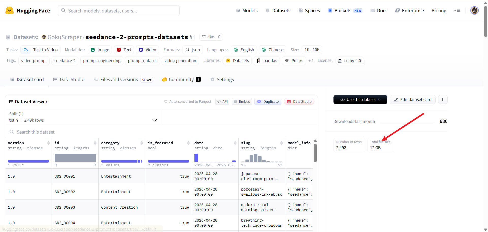
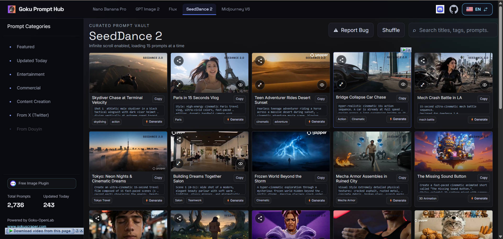

[English](./README.MD) | [简体中文](./README_zh.md)

# 🎞️ Seedance-2-prompts-datasets

[](https://huggingface.co/datasets/GokuScraper/seedance-2-prompts-datasets) [](https://creativecommons.org/licenses/by/4.0/) [](https://huggingface.co/datasets/GokuScraper/seedance-2-prompts-datasets) [](https://huggingface.co/datasets/GokuScraper/seedance-2-prompts-datasets)

> 🎞️ The ultimate Seedance-2 video prompt dataset (12GB+). 2000+ video generation prompts with full metadata and preview frames. Truly open source: No login, no ads, no redirection. Just pure data for AI video creators.

这个项目储存了海量字节跳动 Seedance 2.0 的提示词（Prompts）和由它们生成的预览视频。

整体数据集大小超过 **12GB**，包含 **2000+ 个视频及 Metadata**，且已进行完全结构化处理。由于 GitHub 不适合存储大批量文件，完整数据文件托管在 Hugging Face 平台上。在 Hugging Face 仓库中，主要包含了 **生成的视频（.mp4）**、**视频封面（.jpg）** 以及一个完全结构化并包含详细元数据的 **.jsonl 提示词文件**。

**下载完整数据集体验：**  
[https://huggingface.co/datasets/GokuScraper/seedance-2-prompts-datasets](https://huggingface.co/datasets/GokuScraper/seedance-2-prompts-datasets)



## 🌐 在线观看体验
无需登录，无广告，极速响应。  
👉 **[在线观看入口](https://prompthub.gokuscraper.com/)**



## 📖 项目介绍
**seedance-2-prompts-datasets** 由 **GokuOpenLab** 发起，是一个面向开发者与研究者的 Prompt 数据基础设施项目。

在当前 AI 生态中，Prompt 已经成为新的“生产力接口”，但现实情况往往是：
- Prompt 数据高度分散
- 缺乏统一结构标准
- 难以检索与批量复用
- 不适合工程化集成

本项目的目标不是“简单地展示 Prompt”，而是：
> 将互联网或生成社区中的 Prompt 转化为**可结构化、可计算、可二次开发的数据资产**

## 🚫 我们反对什么？(Our Manifesto)
在构建这个项目之前，我们看透了目前开源社区的种种乱象，并坚决说“不”：
- **反对黑盒式 Prompt 分发：** 不提供结构化数据、不支持二次使用的封闭系统
- **反对流量导向的伪开源：** 将 GitHub 作为引流入口，却将核心数据隐藏在私有平台强制登录获取
- **反对不可计算的数据形态：** 仅提供纯文本展示、无法被程序解析或训练使用的松散 Prompt 集合

## ✨ 项目优势（Goku Prompt Hub）

### 1️⃣ 全量数据开放
所有收录数据均可完整获取，不存在“试看内容”或“核心数据锁定”。
- 支持 Huggingface 直接全量下载
- 支持通过网站无门槛观看与检索

### 2️⃣ 结构化数据体系 (.jsonl)
我们的提示词数据被统一存储在 .jsonl 格式的文件中。每条 Prompt 均经过严格的标准化解析，并将视频实体、封面图片与参数完美关联。

*JSONL 结构化数据单条示例：*
`json
{
  "version": "1.0",
  "id": "SD2_00133",
  "category": "Entertainment",
  "is_featured": false,
  "date": "2026-04-28",
  "slug": "glacial-tiger-vs-frost-serpent",
  "model_info": { "name": "seedance", "version": "2.0" },
  "raw_p": "Environment: A colossal glacial canyon under pale blue twilight...",
  "media": {
    "v": "seedance-2/videos/SD2_00133.mp4",
    "c": "seedance-2/covers/SD2_00133.jpg"
  },
  "spec": { "width": 1280, "height": 720, "ratio": 1.78, "duration": 15.12, "safety_rating": "Safe for Work" },
  "i18n": {
    "zh": {
      "t": "冰谷虎蛇战",
      "p": "环境：一座巨大的冰川峡谷，笼罩在淡蓝色的暮光之下...",
      "tags": ["冰川峡谷", "冰虎", "霜蛇"]
    },
    "en": {
      "t": "Glacial Tiger vs Frost Serpent",
      "p": "Environment: A colossal glacial canyon under pale blue twilight...",
      "tags": ["ice canyon", "frozen battle", "cinematic"]
    }
  },
  "platform": "x",
  "sourceLink": "https://x.com/LudovicCreator/status/2045419585491317186",
  "file_name": "seedance-2/videos/SD2_00133.mp4"
}
`

### 3️⃣ 开发者友好设计
- **统一 JSON Schema**: JSONL 格式能够完美地将数据逐行格式化为独立的 JSON 对象。
- **开箱即用支持数据库**: 极佳的数据集成度，支持一键无缝存入 SQLite、Supabase 或你的本地 AI 工具链。
- **一行 Python 代码即可加载**: 只需 1 秒即可将整个数据集直接加载为 Pandas DataFrame：

```python
import pandas as pd

# 极速加载数据集！
url = "https://huggingface.co/datasets/GokuScraper/seedance-2-prompts-datasets/raw/main/metadata.jsonl"
df = pd.read_json(url, lines=True)
print(f"✅ 成功加载 {len(df)} 条结构化视频提示词！")
```

### 4️⃣ 开放许可（CC BY 4.0）
所有数据均采用 **CC BY 4.0 协议** 共享：
- ✔ 可自由使用
- ✔ 支持商业化
- ✔ 允许二次加工
- ✔ 允许再分发
- ❗ 仅需保留来源标注

## 📊 数据概览
- **总 Prompt 数量：** 2110+
- **覆盖语言：** 英文 / 中文
- **适用模型：** 字节涵盖核心（Seedance）及 Midjourney / Stable Diffusion / DALL·E 3 / Flux 等
- **数据更新：** 持续自动化同步解析

## 🛡️ 数据来源与免责声明
本仓库中的 Prompt 及相关元数据来源于互联网公开社区，仅用于学习研究与数据结构化处理用途。原始内容的版权及相关权益归原作者所有。

本项目仅提供：
- 杂项数据整理
- 结构化与规范化处理
- 标签分类与快速索引

我们不主张对原始创作内容拥有版权。如权利人认为内容存在问题，可通过 Issue 或邮件联系我们处理。同时，本项目不隶属于 Bytedance、OpenAI、Google、Midjourney 等任何模型开发实体或平台。

## 🤝 参与贡献
欢迎参与 Goku Prompt Hub 一同建设大模型时代的基础设施：
- **提交 Issue：** 反馈低质量、失效或重复解析的 Prompt
- **提交 PR：** 贡献你的高质量 Prompt 结构化数据集
- **Star 支持：** 给个🌟，推动 Prompt 数据开源生态真正落地！

---
*Happy Prompting!*


<!-- STATS_START -->

## 📊 数据统计
- 总 Prompt 数量：**8549**
- 今日更新（UTC 2026-08-02）：**26**

## 🎬 今日更新
### 🎬 赛博偶像双人热舞
<br>
<a href="https://prompthub.gokuscraper.com/en/seeddance2/prompt/cyber-idol-duo-live-SD2_11022">🌐 在线观看</a>

#### 📝 Prompt
```
@画像1を二人の人物严格地参考了面部、发型和服装，长发黑发偶像总是在屏幕左侧，短发棕发偶像总是在右侧。 @画像2は一つの巨大サイバーライブ会場を示す環境デザイン資料として参照し，2×2网格和白色边框在视频中并未显示。 高清院线动漫风格设计，角色参考图像透明的卡通效果，电影级CG场地，配备深邃的电影级CG，蓝色、青色和紫色激光，音波LED，座无虚席的观众，以及无数蓝色荧光棒。 0-1.8秒：从副歌高潮开始，没有任何前奏。 超广角正面视角：两人已经站在舞台中央，手持麦克风，齐声唱歌跳舞。第一拍，激光和荧光棒同时爆炸亮起，摄像机迅速聚焦 [剪辑] 1.8-3.8秒：低角度全身双人镜头，配合有力的对称步伐和与节拍同步的手臂摆动，黑褐色头发，半透明的袖子、裙子和背后的丝带根据惯性剧烈摆动。 每迈出一步，青色光芒便从地板上蔓延开来。 [剪辑] 3.8-5.9秒：前方特写两人，镜头在他们之间流畅切换，长黑发和短棕发交替对着镜头唱歌，结尾是微笑和眨眼。 没有明确的歌词;自然的女声组合完美同步了她们的嘴巴动作和声音，每人只拿一个麦克风。 [剪辑] 5.9-8：在一个横向镜头中，两个人排成一排，跑到舞台前方，伸出麦克风和手挑衅观众。 观众同时举起荧光棒，随着欢呼声的压力，身后的音频波形LED发出响亮的跳动 [停] 8.0-10.2秒：全身中心击球，两发同时旋转，背靠背。 镜头围绕他们两人旋转半圆，服装上青紫色发光线条描绘出圆形光轨，激光射出 [停] 10.2-12.6秒：在极低的角度下，两人同时小幅度跳跃，落地时，一圈巨大的蓝紫色光环从地板蔓延到观众席。 镜头从着陆后猛地向上倾斜，捕捉到两人高举麦克风的笑容 [剪辑] 12.6-15.0秒：镜头顺畅倒带，展示巨大竞技场的全景。 两人靠在一起，双臂张开，完美同步地向观众发出最后一击。 背景中的LED、激光、火花和发光的音波在最后节拍达到最高亮度，原始背景音乐也清晰地以强劲的终结和弦和鼓点完成，留下短暂的欢呼回响，并在最后0.5秒保持着最终姿势。 音乐：从最初0秒开始，副歌就全力以赴，原创赛博J-POP约160 BPM，四拍音效，锐利的合成器琶音，厚重的电音贝斯，强劲的鼓点，明亮的女声二重唱，观众呼喊，宽广的场馆回响，视频动态、灯光和降落完全同步，没有淡入，没有安静的开场。 只有他们两人出现，面孔、发型、服装、体型和左右关系都被保留了下来。 禁止角色增多、第三偶像、面部或服装变化、肢体畸形、手指异常、身体融合、麦克风扩散、歌声与嘴巴错位、文字、字幕、标志、水印以及显示下一部分的结尾。
```

#### 📌 Details
- Ratio: `1.78` | Duration: `15.08s`

---

### 🎬 武士烈焰剑斗
<br>
<a href="https://prompthub.gokuscraper.com/en/seeddance2/prompt/cinematic-samurai-sword-fight-SD2_11020">🌐 在线观看</a>

#### 📝 Prompt
```
一段从昏暗、粗糙庭院开始的电影真人场景。一位脸上沾满泥土的粗犷战士，正用粗壮的木杖在沉重的石轮上磨擦。木屑和发光的火花在一束自然阳光下以极慢动作飞射入摄像机。突然画面切换到爆炸性的夜战场。一段快速拍摄的电影蒙太奇，展现了真人武士激烈的高速剑斗。巨大的实用火焰爆发和橙色发光的余烬从它们碰撞的金属刀刃中爆发出来，照亮了黑暗迷雾的环境。超现实的电影灯光，黑暗中旋转的发光粒子。极近特写战士们，脸上带着坚定而坚定的表情，汗水从脸上滴落。动态的镜头运动围绕快节奏的动作旋转。使用35毫米胶片拍摄，采用变形镜头，实现自然光晕和深邃的电影散景效果。盔甲皮肤和火焰的真实纹理完美无瑕。宽高比为16：9。时长15秒。种子2.0。音乐引发了沉重的电影级低音，随后过渡为高能量的管弦摇滚混合体，带有激烈的弦乐断奏和部落战鼓。
```

#### 📌 Details
- Ratio: `1.78` | Duration: `15.14s`

---

### 🎬 仙侠师姐冷面吐槽
<br>
<a href="https://prompthub.gokuscraper.com/en/seeddance2/prompt/xianxia-sister-ghost-prank-SD2_11018">🌐 在线观看</a>

#### 📝 Prompt
```
【整体风格】 电影级写实质感，纯古风中国仙侠美学，前半段以灵异悬疑建立紧张感，后半段反转为克制的冷面喜剧；采用古典留白构图、清冷月光、温暖灯笼光、墨蓝与褪色象牙白色调、细腻胶片颗粒和具有明确方位的声音误导，全片不出现任何现代元素。 【角色】 角色 ID A｜剑仙师姐 剑仙师姐 @图片 1，25–30 岁的东亚女性，椭圆脸，白皙自然肤色，深色杏眼，黑色长发半挽，以白玉簪固定，身材高挑纤细，穿白色刺绣真丝汉服、半透明分层宽袖、浅银色腰封、玉佩和白色布靴。她从庭院进入，从鞋到头完整出现在画面中，手持一柄银色长剑和一盏青铜灯。 角色 ID B｜小师妹 小师妹 @图片 2，20–25 岁的东亚女性，圆润灵动的脸，黑发编辫，身形娇小，穿青绿色亚麻汉服、深色布腰带、木簪和黑色布鞋，额外披着一层可取下的白色薄纱，手持竹简戏本，藏在同一面紧闭的屏风后。 【镜头 1｜0-5s｜低角度全景跟拍】 午夜荒废的山门戏台，湿润石板地面、深色瓦檐、褪色红色帷幕、紧闭的纸质屏风、雕花木柱、随风摇晃的竹林、一座香炉和两盏青铜灯共同建立清楚稳定的空间关系。 角色 ID A：剑仙师姐 @图片 1，25–30 岁的东亚女性，椭圆脸，白皙自然肤色，深色杏眼，黑色长发半挽，以白玉簪固定，身材高挑纤细，穿白色刺绣真丝汉服、半透明分层宽袖、浅银色腰封、玉佩和白色布靴。她从庭院进入，从鞋到头完整出现在画面中，手持一柄银色长剑和一盏青铜灯。 角色 ID B：小师妹 @图片 2，20–25 岁的东亚女性，圆润灵动的脸，黑发编辫，身形娇小，穿青绿色亚麻汉服、深色布腰带、木簪 and 黑色布鞋，额外披着一层可取下的白色薄纱，手持竹简戏本，藏在同一面紧闭的屏风后。 戏台内部传来远处女子低泣声和缓慢拖动木头的声音； 【镜头 2｜5-10s｜中景跟拍】 同一个穿白色刺绣真丝汉服的剑仙师姐靠近同一面纸质屏风，灯笼火苗轻轻颤抖，一个弯腰低头、长发垂落的女子影子在屏风后缓慢站起。 同一个小师妹继续藏在屏风后，用凄厉声音拖长喊道：“还我命来 ——” 同一个剑仙师姐拔出同一柄银色长剑，只完成一次转身，随后保持精准克制的防御姿势；摄影机缓慢推近墙面影子，古琴弦音逐渐绷紧，木质地板发出轻微吱呀声； 【镜头 3｜10-15s｜近景揭晓转极近特写】 同一面纸质屏风突然横向拉开，清楚揭示同一个穿青绿色汉服的小师妹披着同一层松散白色薄纱，手中拿着同一本竹简戏本和一只木制醒木，她其实只是在排练女鬼角色。 小师妹露出期待笑容，问道：“师姐，像不像厉鬼？” 同一个剑仙师姐仍然举着剑僵在原地，剑尖停在她身旁，面无表情地回答：“像。再晚半步，你就真是了。” 小师妹的笑容瞬间消失，心虚地吞咽一下。 画面定格在剑仙师姐平静翻白眼的瞬间，恐怖配乐戛然而止，木制醒木掉落并发出一声干脆撞击。 【技术要求】 严格总时长 15 秒，16:9 横屏，三个连贯清楚的镜头，原生同步普通话对白，口型准确，人物面部与服装稳定，灯笼、影子、薄纱、真丝衣料、头发、香烟和长剑运动真实自然，不生成画面字幕，始终只出现两名可见角色。 【负面词】 blurry, bad quality, low quality, low resolution, noisy, jpeg artifacts, watermark, text, error; deformed, mutated, bad anatomy, poorly drawn hands, bad composition, out of frame, disfigured; inconsistent character, changing clothes, face morphing, background shift, glitching cuts, disappearing props
```

#### 📌 Details
- Ratio: `1.78` | Duration: `15.13s`

---

### 🎬 动漫篮球绝杀
<br>
<a href="https://prompthub.gokuscraper.com/en/seeddance2/prompt/anime-basketball-game-winner-SD2_11016">🌐 在线观看</a>

#### 📝 Prompt
```
@image3了一部混合媒体视频，包含2D动漫角色@image1 @image2和超逼真的真人背景。 打造一部电影般的篮球电影，@image1为主角，@image2队友，@image3作为户外城市篮球场，@image3作为黄金时刻灯光氛围。超写实体育转播美学、动态手持摄像机运动、电影级景深、逼真的汗水和球衣物理、流畅的镜头过渡、自然的身体比例、逼真的8K画质。 镜头1（0-2秒）：广角日落镜头。主球员积极带球突破防守球员，队友则分散开来。低角度跟踪摄像机快速的脚步和弹跳的球，背景中充满活力的观众。 镜头2（2-5秒）：中等跟踪镜头。快速胸部传球给队友，随后流畅地无视背后回传。快速的镜头快速切换跟随球，防守球员反应迟缓。 镜头3（5-7秒）：电影特写。主球员接球后进行犹豫运球，专注投篮，传来球鞋摩擦声，戏剧性的夕阳轮廓光线，浅景深。 镜头4（7-10秒）：慢动作结局。主角跳起投中制胜三分球。轨道摄像机和慢速推车跟随球入网，现场观众反应逼真，结尾电影化体育广告。屏幕上没有文字。
```

#### 📌 Details
- Ratio: `1.74` | Duration: `15.13s`

---

### 🎬 高台跳水慢动作
<br>
<a href="https://prompthub.gokuscraper.com/en/seeddance2/prompt/olympic-platform-diving-slow-mo-SD2_11014">🌐 在线观看</a>

#### 📝 Prompt
```
【风格】竞技跳水体育大片（Olympic-style Platform Diving），电视转播+电影感混合质感（16:9 Cinematic, Photorealistic），高速摄影升格（Super Slow-mo），室内跳水馆冷色水蓝影调，国家队级动作规格 【时长】15秒 【场景】室内跳水馆：20米高台，台面铺防滑垫，下方是碧蓝泳池，池底有波光，观众席在背景虚化成暗色块，顶棚射灯列阵 【角色】主角@ [00:00-00:03] 镜头1：台端静止（The Stillness） 低角度仰拍大远景：主角站在20米跳台最边缘，脚尖扣住台沿，双臂前平举，全场安静得只剩水声。 切近景：她深吸一口气，胸口起伏一次，手指微微绷直，眼神锁定前下方水面，下颌收紧。 【音效】场馆环境音骤然安静，只有池水轻微晃动声和一次深呼吸声。 [00:03-00:05] 镜头2：起跳（The Takeoff） 侧面中景固定机位：她双臂向下压、双腿蹬台，向上跃起离台，身体在最高点收紧抱膝，整个人像上了发条的陀螺开始向后翻转。 【音效】蹬台的一声闷响，随后只剩风声。 [00:05-00:10] 镜头3：空中翻腾（The Flight, Super Slow-mo） 升格慢动作，镜头从跳台高度垂直跟随下坠：她在空中完成向后翻腾三周半抱膝，翻转匀速干净，每一周身体姿态都收得极紧，水珠从发梢甩出悬在空中； 翻转到位后突然打开身体，双臂上举合拢成一条直线，笔直指向水面，下落加速，射灯光在她身上快速掠过。 【音效】升格段风声被拉长，翻转时衣料细微的呼呼声，打开身体瞬间一声干脆的"咻"。 [00:10-00:12] 镜头4：压水花入水（Rip Entry） 恢复常速，水面高度侧面机位：她像一根针一样垂直扎入水中，入水点只弹起一圈细小的水纹和几粒水珠，几乎没有水花，水面很快恢复平静。 【音效】入水只有一声短促干净的"噗"，随后场馆爆发出观众的惊呼和掌声。 [00:12-00:15] 镜头5：水下与出水（Underwater + Rise） 水下机位：她入水后身体舒展，气泡呈一条笔直的银色柱状拖在身后，她在蓝色水中翻身向上； 切水面机位：她破水而出甩了下头发，抬手抹去脸上的水，望向记分牌方向露出笑容，画面定格。 【音效】水下低频的咕噜声转为出水瞬间的清亮水声，掌声持续，定格配一声上扬收束音。 【备注】全片入水水花越小越好（Rip Entry压水花技术），空中翻腾必须姿态紧凑、转速均匀，避免肢体松散
```

#### 📌 Details
- Ratio: `1.78` | Duration: `15.08s`

---

### 🎬 奢华时尚电影感广告
<br>
<a href="https://prompthub.gokuscraper.com/en/seeddance2/prompt/luxury-cinematic-fashion-commercial-SD2_11010">🌐 在线观看</a>

#### 📝 Prompt
```
15秒超写实电影时尚广告。一位时尚的年轻女子穿着白色剪裁西装外套、白色合身方领上衣、高腰白裤、超大号黑色方形太阳镜、细金项链和小巧金色圈耳环，自信地走在一家现代豪华咖啡馆外，咖啡馆落地玻璃窗、奶油色露台伞、木桌和米色石地板。温暖的黄金时阳光投下柔和的自然阴影。她轻轻调整太阳镜，微笑着，优雅自信地走向镜头。平滑的云台追踪、浅景深、电影化散景、85mm人像镜头、HDR、高级调色、逼真皮肤质感、奢华时尚风格、超写实、4K、60fps。没有文字，没有标志，没有水印，没有服装变化，没有背景变化，没有额外的人物，没有模糊，没有失真。
```

#### 📌 Details
- Ratio: `0.56` | Duration: `15.13s`

---

### 🎬 荒漠女战狮
<br>
<a href="https://prompthub.gokuscraper.com/en/seeddance2/prompt/woman-battles-lions-desert-arena-SD2_11002">🌐 在线观看</a>

#### 📝 Prompt
```
一段15秒的超写实电影动作场景，展现一位无畏的女性在古老沙漠竞技场与一群野狮搏斗。

镜头1（0–3秒）：
极宽的电影镜头，展现一座被岩石山脉环绕的古老废墟竞技场，映照在夕阳下。一位身穿粗犷战士服的强壮女子独自站在中央，三只巨大的狮子缓缓从阴影中逼近。尘土在空中飞舞，紧张的氛围令人紧张。

镜头2（3–6秒）：低角度动作镜头，狮子们向她冲来。镜头快速绕场景移动，她以惊人的敏捷躲避了第一波攻击，滑行在地面上，尘土在她周围爆炸。逼真的狮子动作，细致的毛发，电影般的动作模糊。

镜头3（6–10秒）：快节奏战斗。女子运用技巧和智慧反击，躲避攻击，逐一压制狮子。动态镜头角度，她坚定表情的特写，慢动作展现强有力动作，逼真的物理效果和紧张的动作编排。

镜头4（10–13秒）：
最后一只狮子戏剧性地向她跳去。镜头慢动作旋转，她格挡攻击，并用强有力的最后一击击败狮子。尘土弥漫，竞技场陷入寂静。

镜头5（13–15秒）：
史诗级英雄镜头。女子站在竞技场中央，胜利而退，击败的狮子们退向远方。镜头缓缓拉远，展现出广阔的景色、金色夕阳、风吹动她的头发和衣服、电影般的胜利时刻。

风格：极度写实好莱坞动作片，史诗级规模，逼真的动物动作，戏剧性的灯光，电影感十足的摄影，细致的纹理，4K画质，自然运动，紧张的氛围。否定提示：卡通，奇幻CGI风格，不真实的动物，模糊，糟糕的解剖结构，额外的肢体，不自然的战斗，血腥，血腥，扭曲的脸部，闪烁，低质量，水印。
```

#### 📌 Details
- Ratio: `1.78` | Duration: `15.05s`

---

### 🎬 古寺粉衣武舞
<br>
<a href="https://prompthub.gokuscraper.com/en/seeddance2/prompt/pink-hanfu-combat-dance-ancient-temple-SD2_10998">🌐 在线观看</a>

#### 📝 Prompt
```
在一座巨大的古老寺庙内，石柱高耸，大理石地板破裂，尘埃飘散，阳光强劲透过天花板洒下，一位身穿优雅流畅粉色汉服战斗服的年轻女武者，表演着非凡的战斗舞蹈。画面以超宽镜头开场，她优雅地滑过抛光石地板。她的丝绸袖子和层叠裙摆随着每一个动作自然飘动，镜头以流畅的360度旋转环绕她。她突然施展高空旋转踢，空中翻转，精准无瑕的武术精准。镜头切换到极低角度镜头，突出她的身高与力量，裙摆随波纹真实地起伏。动作转为戏剧性的慢动作，她轻柔落地，随后迅速加速，迅速旋转脚步。每一个动作都创造出逼真的布料模拟、细微的尘埃爆发和完美同步的身体力学。她高高跃入一道耀眼的天光之下。镜头从下方跟随，立体光影环绕着她，形成天使般的轮廓。她的表情依旧平静、专注且无所畏惧。当她开始在空中旋转时，发光的金色能量丝带在她身上展开，像魔法龙形的水流般向外螺旋扩散。火花、漂浮的余烬和旋转的粒子自然地响应她的动作。镜头拉远进入令人屏息的广角镜头，金色能量龙卷风在寺庙地面蔓延，温暖的橙色倒影照亮古老的建筑。尘埃自然升起，光线在大气中真实地散射。最后一刻以史诗般的慢动作定格，她优雅地漂浮在天穹光束下发光螺旋的中心，周围环绕着旋转的金色能量环。镜头缓缓向上拉，从上方俯瞰壮丽的神庙，随后渐渐变黑。
```

#### 📌 Details
- Ratio: `1.78` | Duration: `15.08s`

---

### 🎬 她的一天
<br>
<a href="https://prompthub.gokuscraper.com/en/seeddance2/prompt/day-in-her-life-SD2_10994">🌐 在线观看</a>

#### 📝 Prompt
```
使用上传的分镜图作为视觉序列参考，保持整部电影中同一个美丽的年轻女性形象。保持相同的面部识别、发型、肤色、妆容、黑色合身露脐上衣、灰色运动裤、黑色单肩包、身体比例和配饰，贯穿每个场景。确保角色形象的完美一致性和真实的解剖结构。 打造一部超现实的电影感《我生命中的一天》生活电影，配合高端商业摄影。氛围应当平静、真实且充满理想，采用温暖的自然光、柔和阴影、逼真的倒影、电影般的色彩调色、浅景深、流畅的手持和万向节摄像机运动，以及细腻的环境氛围。 影片开始时，她安然入睡，床边响起闹钟。她慢慢醒来，拿起手机，关掉闹钟。她走进现代浴室，用冷水洗脸后穿好衣服。站在一个敞开的衣柜旁，她选了一件黑色夹克，然后在极简厨房里准备一杯健康的奶昔，喝了一口。 她离开公寓，自信地穿过热闹的街道，进入地铁站。她乘扶梯，站台上等车，登上拥挤的地铁，静静观察周围的人。到达后，她穿过办公室大堂，乘电梯，进入一个现代开放的工作区，专注地使用笔记本电脑。 工作日结束时，她在黄金时分漫步城市，享受宁静的夜晚氛围。影片以她回到卧室，躺在床上，带着轻松的微笑滑动手机，然后将手机放在身旁闭上眼睛作为结尾。 风格：高端生活方式广告，写实的日常生活，电影般的叙事，自然表演，奢华的调色，柔和散景，细腻的镜头光晕，平滑的转场，情感温暖的氛围，照片级写实，极其细致，商业品质。 负面提示：无文字，无字幕，无标志，无水印，无重复人物，无扭曲解剖，无不真实面部特征，无AI伪影，无卡通风格，无闪烁，无过饱和色彩，无突兀过渡。
```

#### 📌 Details
- Ratio: `1.78` | Duration: `14.55s`

---

### 🎬 浣熊倒盐翻车记
<br>
<a href="https://prompthub.gokuscraper.com/en/seeddance2/prompt/raccoon-salty-cooking-fail-SD2_10992">🌐 在线观看</a>

#### 📝 Prompt
```
真人+平面2D贴纸合成，视角烹饪vlog，垂直9：16,10秒，8K，轻量手持微摇。真实厨房+搞笑平面贴纸角色。 场景：第一人称视角的家庭厨房。牛肉和青菜在黑锅里煎炸，油嘶嘶作响，蒸汽升腾。白色瓷砖，酱瓶，水槽在右侧，阳光明媚。 角色：小Q版浣熊索尔卡，平面2D贴纸：灰蓝色毛发，眼周戴深色面具，条纹尾巴，大红蝴蝶结，圆形黑眼镜，黄色连衣裙，红色鞋子。轮廓粗，纸质质感，彩色铅笔风格。坐在炉子旁的小凳子上。 00：00–00：03 — 咸雪崩 真手用铲子搅拌肉类。索尔卡狡黠地笑着，往锅里倒了一整罐盐。盐如瀑布般倾泻而下，形成白色的土丘。 音效：滋滋作响，盐倒。 00：03–00：05 — 哎呀 手把罐子拿走，锅铲在她头旁发出滑笑的“砰！”声。眼镜滑落，尾巴竖起，索尔卡跳了起来。 音效：砰，卡通弹簧。 00：05–00：08 — 咸味报复 索尔卡尝了尝过咸的食物。脸颊鼓起，眼睛变成螺旋，卡通般的泪水从眼中喷涌而出。 音效：咔嚓声、停顿、夸张的哭泣。 00：08–00：10 — Salty K.O. 她咽了口口水，眼睛变成了X形，像纸贴一样从凳子上摔了下来。头顶上星星，最后定格画面。 音效：沙哑声、轻微撞击声、幽默灵体音效。 负面提示：3D浣熊、逼真的毛皮、重新设计、额外肢体、畸形手部、变形、闪烁、模糊、假盐物理、血腥、字幕、水印、界面。
```

#### 📌 Details
- Ratio: `0.57` | Duration: `15.08s`

---

### 🎬 小饭馆慵懒老板娘
<br>
<a href="https://prompthub.gokuscraper.com/en/seeddance2/prompt/lazy-boss-lady-diner-comedy-SD2_10990">🌐 在线观看</a>

#### 📝 Prompt
```
第一幕：【参考锁定】 参考图1 hf_20260730_044943_833909d3-0181-4d86-b4ad-8fdd91945fbd 为老板娘#1 穿着 hf_20260730_045132_8f945ce1-0e33-4e9c-86c6-5b5bdb0b0185 腿脚比例、薄袜质感、沙发坐姿及黑色高跟鞋位置的最高优先级；保持#1已经预设的脸部、发型、妆容和服装。 参考视频为小饭馆空间、男#2 与食客#3 的外貌、身形、服装和生活化表演节奏的最高优先级。 #1、#2、#3均为成年人，不得换脸、复制、合并或互换身份。 【整体设定】 真实小饭馆生活喜剧。 老板娘#1坐在左后方休息区沙发上刷手机，呈现克制、自然的“海妖风 Pose”：身体斜靠沙发，一侧肩膀略微下沉，腰背形成自然柔和的S形曲线；双腿优雅交叠并略微伸向前方，脚尖放松；头部轻轻侧倾，黑色长发自然落在一侧肩头。姿态具有安静、慵懒、带吸引力的气质，但不主动挑逗食客，不舔嘴、不抛媚眼、不刻意扭动身体。 男#2坐在右前方的第一张绿色旧餐桌吃面。食客#3坐在右后方另一张独立餐桌吃面，两张桌子之间留有清楚的过道，二人绝不坐在同一张桌子旁。 男#2吃面时看老板娘#1短暂发愣，随后叫她拿一瓶橙色饮料。食客#3从餐桌第一次出现时就坐在另一张桌子吃面，为后续反转建立空间位置。 【真实系拍摄】 未经处理的iPhone手持真实视频。9:16竖屏，1080×1920，30fps，26—28mm等效焦段，普通食客站在约1—1.5米外拍摄。 自动曝光、自动对焦、自动白平衡。保留轻微手抖、呼吸起伏、重新取景的半拍延迟、短暂对焦搜索、运动模糊、窗边局部过曝和暗部噪点。 无滤镜、无美颜、无磨皮、无电影布光、无稳定器运镜、无人工浅景深。保留真实皮肤纹理、零散发丝、服装褶皱和薄袜自然反光。 【人物位置】 老板娘#1：左后方米灰色双人沙发。斜靠沙发刷手机，保持自然海妖风坐姿，暂时没有注意食客。 男#2：右前方第一张绿色旧餐桌，独自吃面，是开口叫饮料的人。 食客#3：右后方第二张独立旧餐桌，与男#2相隔约一米，中间有明显过道。他独自吃面，不与男#2同步动作，也不提前说话。 【空间与道具】 左后方：米灰色沙发、老板娘的手机、一双放在脚边的黑色高跟鞋，其中一只更靠近镜头。 中央后方：饮料冰柜、服务台、米黄色记账本。 右前方第一桌：男#2、一碗面、一双筷子、一小碟调料。 右后方第二桌：食客#3、另一碗面、另一双筷子、另一小碟调料。 两名男食客的桌子、面碗、筷子和调料完全独立，不共享、不复制、不交换。 冰柜内只有一瓶橙色饮料：约500毫升透明硬质塑料瓶，内部为自然透光的橙黄色液体，彩色防盗环旋盖。全片只出现这一瓶，不得提前出现在餐桌上。 【15秒严格分镜】 → 0—2秒：低机位脚部建立镜头 镜头从老板娘#1搭在沙发边缘的双腿开始。她维持克制的海妖风坐姿：双腿自然交叠，腿部略向前伸，薄袜有细腻但不过度的真实反光，脚尖自然放松。 一双黑色高跟鞋放在木纹地面，其中一只靠近前景。自动对焦短暂搜索后落在前侧脚部和沙发边缘。镜头只作快速生活化建立，不缓慢扫描腿部。 → 2—4秒：老板娘沙发中景 摄影者自然抬高手臂，镜头快速上移到老板娘上半身。她身体斜靠沙发，一侧肩膀稍低，腰背呈柔和S形曲线，头部轻轻侧倾，长发落在一侧肩头。 她低头用拇指滑动手机，嘴角因手机内容出现很浅的笑意，神态安静慵懒，没有看两名食客。对焦从前景自然漂移到她的脸。 → 4—6.8秒：两张餐桌同框 硬切右侧用餐区稍宽中景。男#2坐在右前方第一张桌子；食客#3清楚出现在右后方第二张桌子。两张桌子之间有明显过道。 男#2吸入一口面，随后抬眼越过面碗，看向左后方的老板娘。筷子停在嘴边，剩余面条短暂悬在筷子与碗之间，他自然走神。 食客#3始终在另一张桌子低头夹面、吹面和咀嚼，不抬头，不与男#2同步。 → 6.8—8.5秒：男#2叫饮料 男#2眨一下眼回过神，把剩余面条吸完，朝老板娘方向抬手喊： “老板娘，再来瓶饮料！” 食客#3仍在右后方自己的桌子吃面，只在听见声音时出现非常轻微的停顿，但不抬头、不说话。 → 8.5—10.5秒：老板娘响应并起身 硬切老板娘中景。她停止滑动手机，抬眼看向男#2，平静回应： “哎，来啦。” 她锁上手机，将手机正面朝下放在沙发扶手上。随后结束斜靠姿态，身体自然前倾，双脚分别滑入地面上的一双黑色高跟鞋并起身。手机必须留在沙发扶手上。 → 10.5—12.5秒：冰柜取饮料 硬切冰柜侧面中景。冰柜侧面中景。老板娘打开老式玻璃冰柜，只取出一瓶密封橙色饮料；左手顺势从服务台拿起米黄色记账本。冰柜关闭后，她立即转入中央过道，行走时身体微侧成S曲线，胯部轻微侧推，双腿前后错位拉长，半垂眼冷感前视。 → 12.5—15秒：送到男#2桌边 手持镜头跟随老板娘从左后方向右前方快步移动，画面产生自然上下晃动和轻微运动模糊。 她停在两桌之间的过道中央，身体微侧朝向画面左侧的男#2，形成流畅S曲线，肩颈拉长，半垂眼冷感直视#2，把橙色饮料放在#2桌面：“来，您的饮料。” 最后一帧：橙色饮料仍然密封，老板娘左手拿着记账本；两个男食客分别坐在两张不同餐桌旁。 【音频】 仅使用饭馆画内自然声：冰柜压缩机、排风扇、远处交谈、吸面声、筷子碰碗声、高跟鞋落地声、柜门开合声、脚步声和饮料瓶接触桌面的声音。 对白带真实饭馆混响，距离改变时音量自然变化。无背景音乐、旁白、罐头笑声和后期音效。 【连续性要求】 老板娘始终从左后方向右前方移动。男#2固定在右前方第一桌，食客#3固定在右后方第二桌，两人不得坐到一起。 #3从用餐区第一次出现时就必须清楚存在。两张餐桌、两碗面、两双筷子各自独立。橙色饮料只能从冰柜取出一次，送到男#2桌边时仍然密封。 老板娘的海妖风 Pose只出现在沙发段落；起身工作后恢复自然、利落的饭馆老板娘动作。 【负面提示】 不要让男#2和食客#3坐在同一张桌子；不要共享面碗、筷子或调料；不要把#3生成成#2的复制人；不要两人同步吃面、同步抬头或同步说话。 不要把海妖风姿态表现成跳舞、扭胯、抛媚眼、舔嘴、夸张挺胸或情色表演；不要色情化腿脚镜头，不要缓慢扫描身体。 不要改变#1的脸、发型、服装、腿脚比例和薄袜质感；不要让手机、高跟鞋、面条、筷子、记账本或饮料漂浮、瞬移、复制。 不要把普通小饭馆变成豪华餐厅；不要HDR、电影调色、强烈光晕、过强虚化、塑料皮肤、稳定器运镜、慢动作、字幕、水印或平台UI。 第二幕：【参考锁定】 参考图1 hf_20260730_044943_833909d3-0181-4d86-b4ad-8fdd91945fbd 为老板娘#1 穿着 hf_20260730_045132_8f945ce1-0e33-4e9c-86c6-5b5bdb0b0185 时的腿脚比例、薄袜质感、身体线条及黑色高跟鞋造型的最高优先级；保持#1预设的脸部、发型、妆容和服装。 参考视频为小饭馆空间、男#2 与食客#3 的外貌、身形、服装和生活化表演节奏的最高优先级。 三人均为成年人，不得换脸、复制、合并或互换身份。 【续写起点】 使用Part A最后一帧 7月30日 ：老板娘#1站在两张餐桌之间的过道位置，身体微侧面对男#2，左手拿米黄色记账本；男#2坐在右前方第一张绿色旧餐桌，右手刚碰到桌上唯一一瓶密封橙色饮料；食客#3坐在右后方第二张独立餐桌，手中拿着筷子，从侧后方观察。 老板娘的手机仍留在左后方沙发扶手。人物、桌椅、餐具、灯光和饭店空间完全延续Part A。 【整体设定】 男#2询问饮料价格，听见六块后只肯出五块。老板娘不争辩，保持克制自然的海妖风Pose，收回饮料，打开后喝一小口，再把喝过的饮料递给男#2。 食客#3看见全过程，停止吃面，看着老板娘说：“这样的，给我来一箱。”老板娘嘴里仍含少量饮料，冷艳表情瞬间破功，用记账本遮住下半张脸，忍不住将饮料笑喷在记账本背面。 【真实系拍摄】 未经处理的iPhone手持真实视频。9:16竖屏，1080×1920，30fps，26—28mm等效焦段，普通食客在约1—1.5米外拍摄。 自动曝光、自动对焦、自动白平衡。镜头在男#2、老板娘与食客#3之间转动时，保留轻微手抖、呼吸起伏、重新取景的半拍延迟、短暂对焦搜索和真实运动模糊。 白平衡在店门自然光、冷白荧光顶灯和冰柜余光之间轻微变化。图像平坦，保留窗边局部过曝、暗部噪点、边缘色差和自然皮肤纹理。无滤镜、美颜、磨皮、电影布光、稳定器运镜和人工浅景深。 【人物位置与表演】 老板娘#1：站在两桌旁的过道位置，主要面对男#2，同时不能遮挡食客#3观察她喝饮料的视线。身体微侧，肩部放松下沉，颈部自然拉长，腰背与胯部形成柔和S形曲线；双腿前后错位，一条腿承重。半垂眼皮，表情冷静、带距离感，但不主动挑逗。 男#2：固定坐在右前方第一张桌，是问价、砍价和接饮料的人。 食客#3：固定坐在右后方第二张独立餐桌，与#2相隔约一米。他只能观察并说最后一句，不能走到#2桌旁。 【空间与道具】 右前方第一桌属于男#2：一碗面、一双筷子、一小碟调料。 右后方第二桌属于食客#3：另一碗面、另一双筷子、另一小碟调料。 两桌餐具完全独立，不共享、不复制、不交换。 全片只有一瓶约500毫升橙色饮料：透明硬质塑料瓶、橙黄色液体、彩色防盗环旋盖。状态严格连续： 密封满瓶 → #2拿起 → 老板娘收回 → 打开 → 喝一口 → 液面下降 → 递给#2 瓶盖和米黄色记账本不能消失、变形或复制。 【15秒严格分镜】 → 0—2秒：问价与回答 男#2拿起密封橙色饮料，看一眼瓶身，抬头问： “这多少钱？” 自动对焦先落在橙色液体和瓶身高光，再稍慢地转到#2的脸。 老板娘微侧面对他，肩部下沉，颈部拉长。她从半垂眼皮下看一眼饮料，再冷静回答： “六块。” 食客#3仍在右后方自己的餐桌吃面，不提前参与。 → 2—3.8秒：男#2砍价 男#2轻轻掂一下饮料，眉头抬起，商量道： “我就五块，五块行不行？” 食客#3夹面的动作出现轻微停顿，眼睛从面碗上方看向两人，但不抬头说话。 → 3.8—5秒：老板娘收回饮料 老板娘不争辩，也不生气。她安静看#2约0.3秒，保持柔和S形站姿，随后伸出右手握住瓶颈。 男#2确认她握稳后松手。饮料完整回到老板娘手中，两人的手不黏连、不穿模，也不长时间接触。 → 5—6.3秒：开瓶 老板娘把记账本夹在左臂与身体之间，左手握住彩色瓶盖，右手固定瓶身，旋开防盗环瓶盖。 传出清楚的“咔”声。瓶盖保留在左手，饮料没有飞溅。对焦短暂落在手指和瓶盖上。 → 6.3—7.8秒：喝一口 老板娘身体微侧，下巴只抬高约8—10度，颈部线条自然拉长。她抬起橙色饮料喝一小口，半垂眼睛越过瓶身短暂看向男#2，随后自然移开。 液面随瓶身倾斜而倾斜。她只咽下一部分，嘴里保留少量饮料，双唇自然闭合，脸颊仅轻微鼓起。瓶内液面真实下降约一口的体积。 她的站位不能遮住食客#3，#3必须清楚看见她喝饮料。 → 7.8—9秒：递给男#2 老板娘把瓶盖松松扣回瓶口，将已经喝过一口的饮料递给男#2。 男#2在自己的桌边接住瓶身中部。老板娘确认他握稳后才松手。瓶内液体因交接产生两次逐渐减弱的晃动。 男#2先看瓶口，再抬眼看老板娘，嘴巴微微张开，表情错愕。 → 9—11.8秒：食客#3说反转台词 食客#3停止吃面，筷子悬在自己的面碗上方。他先看男#2手中已经打开、液面下降的饮料，再抬眼看向老板娘。 摄影者轻微转向#3，自动对焦短暂搜索后稳定在他的脸上。#3坐在原位，用筷子轻轻指向那瓶饮料，一本正经地说： “这样的，给我来一箱。” #3不站起、不靠近#2，不舔嘴、不挑眉、不做猥琐表情。 → 11.8—15秒：老板娘笑喷 镜头迅速转回老板娘。她嘴里仍含着刚才没有完全咽下的少量橙色饮料。 她原本保持半垂眼皮和冷静S形站姿；听见#3的话后，眼睛突然睁大，眉毛抬起，头部转向#3，身体僵住约0.3秒。 随后她立即举起米黄色记账本遮住下半张脸，肩膀控制不住地抖动，忍笑失败。少量橙色细雾和两三滴饮料短促喷在记账本背面，并从上缘和侧缘溅出后向下掉落。 不能喷到#2、#3、两碗面或其他食物。 最后一帧：男#2坐在第一桌拿着喝过的饮料发愣；食客#3坐在第二桌认真等待一箱；老板娘站在过道，用记账本遮脸轻咳、忍笑。 【音频】 仅使用饭馆画内自然声：冰柜压缩机、排风扇、远处交谈、两桌不同方向的吸面声、筷子碰碗声、瓶盖防盗环断裂声、液体晃动声、吞咽声，以及老板娘结尾的短促呛咳和笑声。 对白与口型同步，声音来源唯一。无背景音乐、旁白、罐头笑声和后期反转音效。 【连续性与负面提示】 男#2固定在右前方第一桌，食客#3固定在右后方第二桌；两人不得合桌、换位、共用面碗和筷子。#2负责问价、砍价和接瓶；#3只能观察并说最后一句，不能参与砍价或碰饮料。 不要改变三人的脸、发型、服装和身形；不要饮料瓶、瓶盖、记账本和餐具漂浮、瞬移、穿模或复制；不要饮料变成水、液面不下降或自动回满；不要假喝、嘴唇穿瓶或提前完全咽下后凭空喷出。 不要夸张扭胯、猫步、舔嘴、吐舌或色情化表演；不要女妖角、翅膀、尾巴和奇幻特效；不要把小饭馆变成豪华餐厅或宾馆；不要大口喷射、呕吐或喷到人物和食物；不要HDR、电影调色、过强虚化、塑料皮肤、稳定器运镜、慢动作、字幕、水印或平台UI。
```

#### 📌 Details
- Ratio: `0.56` | Duration: `37.83s`

---

### 🎬 暗黑奇幻兽骑冲锋
<br>
<a href="https://prompthub.gokuscraper.com/en/seeddance2/prompt/dark-fantasy-beast-charge-SD2_10986">🌐 在线观看</a>

#### 📝 Prompt
```
超现实原创黑暗奇幻战争场景，背景是一片广阔的火山平原，黄昏时分。一支骑乘装甲爬行动物和狼形生物的恐怖野兽骑士军队向一支纪律严明的精英长矛兵冲锋。0–4秒：极广角镜头，显示数百骑乘生物在灰烬和燃烧的草地上奔跑，尘土云和余烬在他们身后爆炸。4–9秒：冲锋旁边的低角度追踪，爪子重击地面，骑士们咆哮，披风和盔甲颤抖，镜头在疾驰的怪物间高速穿梭。9–15秒：猛烈撞击，野兽骑士撞击盾墙，长矛碎裂，身体后退，生物跃过烟雾，阵型在巨大压力下弯曲。史诗般的规模、残酷的能量、超动态摄像机、照片级真实的纹理、电影般的尘埃、灰烬、火花，深橙色火光映衬在黑色风暴云层上。
```

#### 📌 Details
- Ratio: `1.78` | Duration: `15.12s`

---

### 🎬 持枪花园侏儒突袭
<br>
<a href="https://prompthub.gokuscraper.com/en/seeddance2/prompt/armed-gnome-bodycam-takedown-SD2_10984">🌐 在线观看</a>

#### 📝 Prompt
```
拿枪的花园侏儒。以执法摄像头视角。0-4秒破门，4-10秒侏儒用微型武器攻击，10-15秒战斗击倒。
```

#### 📌 Details
- Ratio: `1.78` | Duration: `15.12s`

---

### 🎬 烈焰巨手诛魔
<br>
<a href="https://prompthub.gokuscraper.com/en/seeddance2/prompt/burning-hands-crush-demon-SD2_10980">🌐 在线观看</a>

#### 📝 Prompt
```
严格的第一人称视角，男性英雄，脸部从未显现。不要让英雄的双手始终出现在画面中。手只在闪避恢复和施法时出现。连续镜头，无切换，垂直电影式黑暗幻想，真实的身体驱动摄像机运动。摄像机表现得像英雄的头部和躯干，闪避时有强烈的身体反应，施法时则控制前焦。在燃烧的中世纪城市屋顶上，暴风雨般的黑暗天空下，狭窄的街道，黑色瓦片屋顶，木石房屋，远处的大教堂尖塔，浓密的烟柱，零星屋顶火焰，坠落的余烬，炽热的烟雾空气。一个巨大的恶魔突然从建筑物间的地面爆发，撕裂石头和屋顶线条，周围是尘土、火焰和瓦砾。恶魔庞大无比，身披锯齿状黑色金属重甲，金属板间熔融红橙色裂纹闪烁，鲜红眼睛，角状头盔，巨大的胸膛和肩膀，长而沉重的四肢，真正的重量。一只手握着燃烧的长矛，矛尖燃烧着红橙色。恶魔立刻将燃烧的长矛直奔英雄。在最后一刻，英雄做出好莱坞式的戏剧性后退躲避，低身像《黑客帝国》中一样倾身。短暂慢动作进入，长矛直接划过摄像机，险些从英雄头顶掠过，拖曳火焰、火花和热量扭曲。在那濒临死亡的瞬间，英雄惊恐地呼出一口气：“不......”随后，枪声骤然切换回实时，长矛猛然划过身后的城市。英雄恢复平衡，短暂举起双手施法。前臂上细长的熔融橙红色魔法线条闪耀得更为明亮。恶魔穿过烟火向前迈步，准备再次攻击。英雄向上施放一道强力召唤咒。从高空的暴风云中，两只巨大的燃烧之手从天空降落，不是从英雄的身体，也不是从地面。它们看起来像是神圣的地狱构造，坠落在烟雾中，巨大、对称，明显像巨大的人手，边缘炽热，内燃浓烈的橙色火焰，厚重燃烧的手指，以及受控而有目的的动作。巨大的燃烧之手从恶魔两侧落下，猛烈地向内砸去，左右夹击并碾碎恶魔的躯干。紧密的中心聚焦于冲击力。恶魔剧烈挣扎，盔甲向内弯曲坍塌，熔融的裂缝在胸膛和肋骨上爆开，更加明亮。火焰从裂缝中涌出，压迫的压力加剧。恶魔在巨人手掌中燃烧，内心迅速燃烧，身体化为火焰、黑色灰烬、火花和破碎盔甲碎片。压迫的手不断合拢，直到
```

#### 📌 Details
- Ratio: `1.78` | Duration: `15.03s`

---

### 🎬 磁浮列车夜战
<br>
<a href="https://prompthub.gokuscraper.com/en/seeddance2/prompt/cyber-samurai-train-duel-SD2_10978">🌐 在线观看</a>

#### 📝 Prompt
```
15秒的电影动作场景，乘坐一列磁悬浮战争列车穿越反乌托邦的夜晚沙漠，电暴照亮远处巨大的工业废墟。0.0–3.0秒：低矮跟踪镜头沿列车侧面飞驰，一名赛博武士在磁性外壳上奔跑，靴下火花四溅。3.0–6.0秒：一名镀铬盔甲刺客从悬浮的无人机运输车降落列车顶，霓虹武士刀在风暴中点燃蓝光。6.0–9.0秒：首次剑击激起电弧，慢动作闪电掠过头顶。9.0–12.0秒：高速对决，火车穿越不稳定的车厢，两人几乎失去平衡，列车撕裂瓦砾和倒塌结构。12.0–15.0秒：巨大的空中拉回显现出穿越黑暗荒原的发光列车，决斗在最后一节车厢上继续进行。
```

#### 📌 Details
- Ratio: `1.74` | Duration: `15.08s`

---

<!-- STATS_END -->
